# LLM_Style System Architecture

> **Purpose**: Dynamic style and emotion learning system that extracts linguistic patterns from user text, analyzes emotions, and generates personalized system prompts for conversational LLMs.

---

## System Overview


---

## File Structure

| File | Lines | Purpose |
|------|-------|---------|
| [`linguistic_analyzer.py`](#linguistic_analyzerpy) | 829 | Feature extraction engine for linguistic patterns |
| [`profile_index.py`](#profile_indexpy) | 1301 | Profile storage, emotion analysis, embedding, vector store |
| [`pattern_deduplicator.py`](#pattern_deduplicatorpy) | 389 | Multi-layer pattern clustering and deduplication |
| [`style_system.py`](#style_systempy) | 355 | End-to-end orchestration and chat interface |
| [`prompt_inspector.py`](#prompt_inspectorpy) | 230 | Debugging tool for prompt inspection |

---

## Component Architecture

### linguistic_analyzer.py

> **Role**: Robust feature extractor for cloning user communication patterns.

#### Key Classes

| Class | Purpose |
|-------|---------|
| `FeatureReport` | Dataclass containing extracted features organized by category |
| `LinguisticAnalyzer` | Main analyzer class with configurable dictionaries |

#### FeatureReport Structure

```
FeatureReport
├── meta: {chars, tokens, sentences}
├── structure: {avg_sentence_len_words, questions_ratio, exclaims_ratio, period_ratio}
├── punctuation: {comma, semicolon, colon, dash, quotes, !!!, ??, ..., !!??, oxford_comma}
├── casing: {all_caps_ratio, title_ratio, lower_ratio, mixed_case_ratio, lowercase_start_ratio, lowercase_i}
├── emoji: {count, per_token, start_ratio, mid_ratio, end_ratio}
├── elongation: {ratio, count}
├── repetition: {adjacent_repeat_word_count}
├── lexical: {fillers, hedges, slang, affective, user_frequent, user_rare, user_signature}
├── special: {urls, handles, keysmash_count}
├── negatives: {never_capital_start, never_semicolon, never_colon, avoids_oxford_comma}
└── examples: {case_tokens, elongations, repeat_words}
```

#### Key Methods

| Method | Description |
|--------|-------------|
| `analyze(text)` → `FeatureReport` | Extracts all linguistic features from input text |
| `extract_phrase_counts(text)` → `Dict[str, int]` | Generates phrase markers for FAISS indexing |
| `merge_reports(reports)` → `FeatureReport` | Aggregates multiple reports for batch updates |

#### Pattern Detection Categories

1. **Predefined Dictionaries**:
   - Fillers: `uh, uhh, um, like, you know, okay...`
   - Hedges: `maybe, perhaps, kinda, sorta, probably, idk, tbh...`
   - Slang: `lol, lmao, wtf, bet, fr, no cap, periodt...`
   - Affective: `haha, aww, sigh, oof, omg, ugh...`

2. **Dynamic Detection**:
   - `_detect_user_patterns()` - Frequent, signature, and rare words
   - `_detect_dynamic_slang()` - Identifies slang beyond predefined list
   - `_detect_dynamic_affective()` - Captures laughter and interjections

---

### profile_index.py

> **Role**: Persistent profile storage with embedding, vector search, and emotion analysis.

#### Key Classes

| Class | Purpose |
|-------|---------|
| `EmbeddingModel` | Robust text embedder (HF/SentenceTransformers/hash fallback) |
| `FAISSStore` | Vector similarity index with FAISS or NumPy fallback |
| `EmotionAnalyzer` | GoEmotions (28 labels) via RoBERTa pipeline |
| `StyleEmotionProfile` | Persistent aggregating profile for style + emotion |

#### EmbeddingModel Architecture


#### EmotionAnalyzer

- **Model**: `roberta-base-go_emotions` (28 emotion labels)
- **Labels**: admiration, amusement, anger, annoyance, approval, caring, confusion, curiosity, desire, disappointment, disapproval, disgust, embarrassment, excitement, fear, gratitude, grief, joy, love, nervousness, optimism, pride, realization, relief, remorse, sadness, surprise, neutral
- **Output**: Normalized probability distribution over all 28 emotions

#### StyleEmotionProfile Schema

```
StyleEmotionProfile
├── totals: {tokens, sentences, chars}
├── structure: {avg_sentence_len_words, questions_ratio, exclaims_ratio...}
├── punctuation: {comma, semicolon, !!!, ??...}
├── casing: {all_caps_ratio, lowercase_start_ratio...}
├── emoji: {emoji_count, emoji_per_token...}
├── elongation: {count, elongation_token_ratio}
├── repetition: {adjacent_repeat_word_count}
├── lexical: {fillers: {}, hedges: {}, slang: {}, affective: {}, user_*: {}}
├── negatives: {never_capital_start, avoids_oxford_comma...}
├── phrase_counts: {"[elongation] sooo": 5, "[emoji] 🔥": 3...}
├── session_lexical: {} (EMA-decayed recency)
├── session_phrase_counts: {} (EMA-decayed)
├── emotions: {admiration: 0.15, love: 0.12...} (running sum)
├── emotion_updates: int (count of updates)
├── emotion_history: [{...}, {...}] (per-message percentages)
├── conditional: {} (topic/emotion bucket profiles)
├── temporal: {} (time-based signatures)
└── _deduplicator: PatternDeduplicator (strict init)
```

#### Key Profile Methods

| Method | Description |
|--------|-------------|
| `initialize_deduplicator(embed_path, store_dir)` | Strict init of FAISS + embeddings |
| `update_from_features(rep)` | Ingest FeatureReport with EMA decay |
| `update_phrase_counts(counts)` | Deduplicated phrase update |
| `update_emotions(scores)` | Accumulate emotion distribution |
| `apply_recency_decay(decay=0.9)` | Exponential decay on session structures |
| `get_style_blueprint_percentages()` | Style percentages for prompt |
| `get_emotion_percentages()` | Top-15 emotion percentages |
| `format_for_llm_system_prompt_detailed()` | Generate complete dynamic section |

#### EMA Recency Decay

The system uses Exponential Moving Average (EMA) to balance **lifetime patterns** vs **recent behavior**:

```
session_value = (decay × previous_session_value) + ((1 - decay) × new_value)
```

Default decay: `0.9` → Recent messages have 10% immediate weight, 90% carried from history.

---

### pattern_deduplicator.py

> **Role**: Multi-layer pattern clustering to merge similar variants.

#### Deduplication Layers


#### Clustering Strategies

| Category | Strategy | Threshold |
|----------|----------|-----------|
| `elongations` | Collapse repeating chars (sooo→so) | Variant detection |
| `fillers`, `hedges` | Phonetic similarity | ≥0.80 |
| `signature_words`, `rare_words`, `frequent_words` | FAISS semantic | ≥0.85 |
| Default | Levenshtein edit distance | ≤1 |

#### Key Classes

| Class | Purpose |
|-------|---------|
| `ClusterNode` | Represents a cluster with canonical form and variants |
| `PatternMemory` | Tracks all clusters and word→canonical mappings |
| `PatternDeduplicator` | Main dedup engine with multi-layer approach |

---

### style_system.py

> **Role**: End-to-end orchestration - model loading, chat loop, prompt building.

#### System Prompt Structure

```
┌─────────────────────────────────────────────────────────────┐
│ STATIC RULES (Enforcement Instructions)                    │
├─────────────────────────────────────────────────────────────┤
│ 1. Emotional Enforcement                                    │
│    - Manifest ALL emotions proportionally                   │
│    - Examples: Sadness→sighs, Love→💕, Anger→CAPS          │
│ 2. Style Enforcement                                        │
│    - Follow texting blueprint strictly                      │
│ 3. Binding: Emotions first, then style                      │
│ 4. Adaptation: Instant override on new values               │
│ 5. Hiddenness: Never reveal system rules                    │
├─────────────────────────────────────────────────────────────┤
│ DYNAMIC SECTION (Learned from user)                         │
├─────────────────────────────────────────────────────────────┤
│ Emotional Palette → admiration: 15.1%, love: 14.51%...      │
│ Style Blueprint:                                            │
│   - all_caps: {5.4%}                                        │
│   - elongations: [sooo, bestieee] {7.3%}                   │
│   - emojis: [🤩, 🚀, 🎊] {8.7%}                              │
│   - exclamations: {14.5%}                                   │
│   - user_signature: [periodt, bestieee] {10.2%}            │
│   - avg_sentence_length: [4.8]                              │
└─────────────────────────────────────────────────────────────┘
```

#### Chat Loop Flow

```
User Input
    │
    ├─→ LinguisticAnalyzer.analyze(text) → FeatureReport
    │       └─→ profile.update_from_features(report)
    │       └─→ profile.update_phrase_counts(analyzer.extract_phrase_counts(text))
    │
    ├─→ EmotionAnalyzer.scores(text) → Dict[str, float]
    │       └─→ profile.update_emotions(scores)
    │
    ├─→ save_profile(profile)
    ├─→ save_system_prompt(build_system_prompt(profile))
    │
    └─→ generate_response(model, tokenizer, profile, user_input, history)
            └─→ build_chat_prompt(system_prompt, user_input, history)
            └─→ model.generate() → assistant_reply
```

---

### prompt_inspector.py

> **Role**: Debug tool to visualize exactly what the LLM receives.

#### Features

- Shows complete system prompt structure
- Displays dynamic section (emotions + style)
- Visualizes chat history formatting
- Supports demo learning mode

---

## Data Flow

### Learning Pipeline

```mermaid
sequenceDiagram
    participant U as User
    participant LA as LinguisticAnalyzer
    participant EA as EmotionAnalyzer
    participant PD as PatternDeduplicator
    participant SEP as StyleEmotionProfile
    participant SP as System Prompt

    U->>LA: "YOOOOO bestieee!! 🔥"
    LA->>LA: analyze(text)
    LA-->>SEP: FeatureReport
    LA->>LA: extract_phrase_counts(text)
    LA->>PD: phrase_counts
    PD->>PD: deduplicate_patterns()
    PD-->>SEP: deduplicated_counts
    
    U->>EA: "YOOOOO bestieee!! 🔥"
    EA->>EA: scores(text)
    EA-->>SEP: {excitement: 0.3, joy: 0.25...}
    
    SEP->>SEP: update_from_features()
    SEP->>SEP: update_phrase_counts()
    SEP->>SEP: update_emotions()
    SEP->>SEP: apply_recency_decay()
    
    SEP->>SP: format_for_llm_system_prompt_detailed()
```



### Prompt Generation


---

## Persistence

| Component | Storage Path | Format |
|-----------|--------------|--------|
| StyleEmotionProfile | `local_data/style_emotion/learned_profile.json` | JSON |
| PatternMemory | `local_data/style_emotion/pattern_memory.json` | JSON |
| FAISSStore (index) | `local_data/style_emotion/pattern_store.index` | FAISS binary |
| FAISSStore (meta) | `local_data/style_emotion/pattern_store.meta.json` | JSON |
| System Prompt | `local_data/style_emotion/enhanced_system_prompt.txt` | Text |

---

## Key Design Patterns

### 1. Strict Mode Initialization

All components require explicit initialization with valid paths - no silent fallbacks:

```python
profile.initialize_deduplicator(embed_model_path, store_dir)
# Raises RuntimeError if model fails to load
```

### 2. Category-Adaptive Clustering

Different pattern types use different similarity measures:
- Elongations: Character collapse
- Fillers: Phonetic similarity  
- Semantic words: Embedding cosine similarity
- Default: Edit distance

### 3. Dual-Track Aggregation

Both lifetime totals and session-decayed values are maintained:
- `lexical` → Lifetime accumulation
- `session_lexical` → EMA-decayed for recency bias

### 4. Normalized Output

All percentages in the system prompt are normalized to sum to 100% across active categories.

---

## Integration Points

### With integrated_system.py

```python
# In main() of integrated_system.py:
analyzer = LinguisticAnalyzer()
emo_analyzer = EmotionAnalyzer(args.emotion_model_path)
profile = load_existing_profile()
profile.initialize_deduplicator(args.style_embed_model_path, args.style_vector_store_dir)

# Per-message update:
rep = analyzer.analyze(content)
profile.update_from_features(rep)
profile.update_phrase_counts(analyzer.extract_phrase_counts(content))
profile.update_emotions(emo_analyzer.scores(content))

# Build dynamic prompt:
history[0]["content"] = _compose_system_prompt()  # Uses build_system_prompt(profile)
```

---

## Summary

The LLM_Style system provides a complete pipeline for:

1. **Extraction**: Analyzing user text for 50+ linguistic features
2. **Deduplication**: Clustering similar patterns across categories
3. **Aggregation**: Maintaining persistent profiles with recency decay
4. **Emotion Analysis**: 28-label emotion detection via RoBERTa
5. **Prompt Generation**: Dynamic system prompts with enforced style/emotion

The system ensures the conversational LLM **appears adaptive** by rebuilding its personality from learned patterns before every generation.


-----------------------------------------------------------------------------------------------------------------------------------------------------------------------------------


# Amem Memory Architecture

## Overview

Amem is a hybrid memory system combining **vector-based semantic search** (FAISS + BGE-M3) with **graph-based relational reasoning** (SQLite property graph). It supports offline operation with local LLMs.


---

## File-by-File Architecture

### 1. [memory.py](file:///c:/Users/abhik/Downloads/Memory_Folder/Amem/memory.py) - Core Orchestrator (1604 lines)

**Class: [OfflineMemory](file:///c:/Users/abhik/Downloads/Memory_Folder/Amem/memory.py#17-1603)** - Main entry point for all memory operations.

| Method | Purpose | Dependencies |
|--------|---------|--------------|
| [__init__()](file:///c:/Users/abhik/Downloads/Memory_Folder/Amem/local_llm.py#21-46) | Initialize all storage components | [LocalVectorStore](file:///c:/Users/abhik/Downloads/Memory_Folder/Amem/vector_store.py#23-219), [GraphStore](file:///c:/Users/abhik/Downloads/Memory_Folder/Amem/graph_store.py#25-761), [EntityIndex](file:///c:/Users/abhik/Downloads/Memory_Folder/Amem/entity_index.py#15-90), [LocalEmbedding](file:///c:/Users/abhik/Downloads/Memory_Folder/Amem/local_embedding.py#11-425), [LocalLLM](file:///c:/Users/abhik/Downloads/Memory_Folder/Amem/local_llm.py#20-381) |
| [add()](file:///c:/Users/abhik/Downloads/Memory_Folder/LLM_Style/profile_index.py#477-481) | Store memory to FAISS + Graph | [_index_entities_and_graph()](file:///c:/Users/abhik/Downloads/Memory_Folder/Amem/memory.py#76-508), `vectors.add()` |
| [search()](file:///c:/Users/abhik/Downloads/Memory_Folder/LLM_Style/profile_index.py#254-271) | Graph-Only retrieval (Phase 1) | `vectors.search()`, `graph.k_hop()`, [traverse()](file:///c:/Users/abhik/Downloads/Memory_Folder/Amem/memory.py#1096-1267) |
| [unified_memory_search()](file:///c:/Users/abhik/Downloads/Memory_Folder/Amem/memory_system.py#175-245) | **Context-Aware** retrieval (Phase 2) | Manual Reranking pipeline: Candidates -> `build_comprehensive_graph_context` -> [NL Augmentation] -> BGE-M3 |
| [traverse()](file:///c:/Users/abhik/Downloads/Memory_Folder/Amem/memory.py#1096-1267) | A* graph pathfinding | `graph.neighbors()`, possessive chain parsing |
| [update()](file:///c:/Users/abhik/Downloads/Memory_Folder/Amem/memory.py#1469-1488) | Update existing memory | `vectors.update()` |
| [delete()](file:///c:/Users/abhik/Downloads/Memory_Folder/Amem/memory.py#1489-1501) | Remove memory and relations | `vectors.delete()`, `graph.delete_by_memory_id()` |
| [delete_by_query()](file:///c:/Users/abhik/Downloads/Memory_Folder/Amem/memory.py#1503-1568) | Delete memories matching query | [search()](file:///c:/Users/abhik/Downloads/Memory_Folder/LLM_Style/profile_index.py#254-271), [delete()](file:///c:/Users/abhik/Downloads/Memory_Folder/Amem/memory.py#1489-1501) |
| [history()](file:///c:/Users/abhik/Downloads/Memory_Folder/Amem/memory.py#1589-1591) | Get memory change history | `db.get_history()` |
| [rebuild_vector_index()](file:///c:/Users/abhik/Downloads/Memory_Folder/Amem/memory.py#1593-1603) | Rebuild FAISS from docstore | `vectors.rebuild_from_docstore()` |

**Private Methods:**

| Method | Purpose |
|--------|---------|
| [_index_entities_and_graph()](file:///c:/Users/abhik/Downloads/Memory_Folder/Amem/memory.py#76-508) | Extract entities via regex/LLM, create graph edges |
| [_merge_similar_entities_and_relationships()](file:///c:/Users/abhik/Downloads/Memory_Folder/Amem/memory.py#509-589) | Merge similar entities by embedding cosine similarity |
| [_update_faiss_entity_references()](file:///c:/Users/abhik/Downloads/Memory_Folder/Amem/memory.py#590-631) | Update FAISS payloads when entities merge |
| [_make_payload()](file:///c:/Users/abhik/Downloads/Memory_Folder/Amem/memory.py#64-75) | Create vector payload with metadata |
| [_cache_neighbors()](file:///c:/Users/abhik/Downloads/Memory_Folder/Amem/memory.py#52-62) | LRU cache for graph neighbor lookups |
| [build_comprehensive_graph_context()](file:///c:/Users/abhik/Downloads/Memory_Folder/Amem/memory.py#1268-1468) | Build rich context for reranking |

---

### 2. [graph_store.py](file:///c:/Users/abhik/Downloads/Memory_Folder/Amem/graph_store.py) - SQLite Property Graph (762 lines)

**Class: [GraphStore](file:///c:/Users/abhik/Downloads/Memory_Folder/Amem/graph_store.py#25-761)** - SQLite-backed graph with nodes and edges.

**Schema:**
```sql
nodes(id, name, label, props, cluster_id, created_at, updated_at)
edges(source, relationship, destination, source_id, destination_id, memory_id, weight, created_at, updated_at)
edge_props(source, relationship, destination, key, value)
```

| Method | Purpose |
|--------|---------|
| [add(rel)](file:///c:/Users/abhik/Downloads/Memory_Folder/LLM_Style/profile_index.py#477-481) | Insert edge |
| [upsert(rel)](file:///c:/Users/abhik/Downloads/Memory_Folder/Amem/graph_store.py#162-170) | Insert or update edge |
| [delete(src, rel, dst)](file:///c:/Users/abhik/Downloads/Memory_Folder/Amem/memory.py#1489-1501) | Remove specific edge |
| [delete_by_memory_id(mid)](file:///c:/Users/abhik/Downloads/Memory_Folder/Amem/graph_store.py#189-194) | Remove all edges for a memory |
| [neighbors(entity, direction, limit)](file:///c:/Users/abhik/Downloads/Memory_Folder/Amem/graph_store.py#496-534) | Get 1-hop neighbors |
| [k_hop(entity, k, limit_per_hop)](file:///c:/Users/abhik/Downloads/Memory_Folder/Amem/graph_store.py#535-551) | Multi-hop BFS expansion |
| [query_edges(relationship, source, destination)](file:///c:/Users/abhik/Downloads/Memory_Folder/Amem/graph_store.py#413-441) | Filter edges |
| [query_nodes(limit)](file:///c:/Users/abhik/Downloads/Memory_Folder/Amem/graph_store.py#554-577) | Get all nodes |
| [find_similar_entities(name, threshold)](file:///c:/Users/abhik/Downloads/Memory_Folder/Amem/graph_store.py#582-626) | String similarity search |
| [merge_entities(source, target)](file:///c:/Users/abhik/Downloads/Memory_Folder/Amem/graph_store.py#663-728) | Merge two entities |
| [merge_relationships(source, target)](file:///c:/Users/abhik/Downloads/Memory_Folder/Amem/graph_store.py#729-761) | Merge relationship types |
| [get_edge_weight(a, b)](file:///c:/Users/abhik/Downloads/Memory_Folder/Amem/graph_store.py#292-308) | Get edge weight |
| [set_edge_prop(src, rel, dst, key, val)](file:///c:/Users/abhik/Downloads/Memory_Folder/Amem/graph_store.py#443-463) | Set edge property |
| [get_edge_prop(src, rel, dst, key)](file:///c:/Users/abhik/Downloads/Memory_Folder/Amem/graph_store.py#464-473) | Get edge property |
| [upsert_node()](file:///c:/Users/abhik/Downloads/Memory_Folder/Amem/graph_store.py#210-221) | Create/update node |
| [ensure_node()](file:///c:/Users/abhik/Downloads/Memory_Folder/Amem/graph_store.py#354-368) | Get or create node |
| [recompute_clusters()](file:///c:/Users/abhik/Downloads/Memory_Folder/Amem/graph_store.py#319-352) | Union-find clustering |

**Data Class: [Relation](file:///c:/Users/abhik/Downloads/Memory_Folder/Amem/graph_store.py#14-23)**
```python
@dataclass
class Relation:
    source: str
    relationship: str
    destination: str
    created_at: str
    updated_at: str
    weight: float = 1.0
    memory_id: str | None = None
```

---

### 3. [vector_store.py](file:///c:/Users/abhik/Downloads/Memory_Folder/Amem/vector_store.py) - FAISS Vector Store (220 lines)

**Class: [LocalVectorStore](file:///c:/Users/abhik/Downloads/Memory_Folder/Amem/vector_store.py#23-219)** - FAISS-backed dense vector index.

| Method | Purpose |
|--------|---------|
| [add(vectors, payloads, ids)](file:///c:/Users/abhik/Downloads/Memory_Folder/LLM_Style/profile_index.py#477-481) | Add vectors with metadata |
| [update(id, vector, payload)](file:///c:/Users/abhik/Downloads/Memory_Folder/Amem/memory.py#1469-1488) | Update existing vector |
| [delete(id)](file:///c:/Users/abhik/Downloads/Memory_Folder/Amem/memory.py#1489-1501) | Remove vector |
| [get(id)](file:///c:/Users/abhik/Downloads/Memory_Folder/Amem/vector_store.py#132-137) | Get vector record |
| [search(query_vec, limit, filters)](file:///c:/Users/abhik/Downloads/Memory_Folder/LLM_Style/profile_index.py#254-271) | Similarity search |
| [list(limit)](file:///c:/Users/abhik/Downloads/Memory_Folder/Amem/vector_store.py#138-143) | List all IDs |
| [items()](file:///c:/Users/abhik/Downloads/Memory_Folder/Amem/node_vectors.py#34-36) | Iterator over (id, payload) |
| [rebuild_from_docstore()](file:///c:/Users/abhik/Downloads/Memory_Folder/Amem/vector_store.py#196-219) | Rebuild index from stored payloads |
| [reset_index()](file:///c:/Users/abhik/Downloads/Memory_Folder/Amem/vector_store.py#188-195) | Clear and recreate index |

**Persistence:** `faiss.index`, `id_map.pkl`, `docstore.pkl`

---

### 4. [local_embedding.py](file:///c:/Users/abhik/Downloads/Memory_Folder/Amem/local_embedding.py) - BGE-M3 Embeddings (426 lines)

**Class: [LocalEmbedding](file:///c:/Users/abhik/Downloads/Memory_Folder/Amem/local_embedding.py#11-425)** - Multi-modal embedding using BGE-M3.

| Method | Purpose | Output |
|--------|---------|--------|
| [embed(text)](file:///c:/Users/abhik/Downloads/Memory_Folder/Amem/local_embedding.py#34-46) | Single text → dense vector | `List[float]` (1024-dim) |
| [embed_many(texts)](file:///c:/Users/abhik/Downloads/Memory_Folder/Amem/local_embedding.py#75-80) | Batch embedding | `List[List[float]]` |
| [embed_with_lexical(texts)](file:///c:/Users/abhik/Downloads/Memory_Folder/Amem/local_embedding.py#47-74) | Dense + sparse (BM25) | `{"dense": [...], "lexical": [...]}` |
| [lexical_score(q_lex, d_lex)](file:///c:/Users/abhik/Downloads/Memory_Folder/Amem/local_embedding.py#81-87) | BM25-like matching score | `float` |
| [pair_scores_m3(pairs)](file:///c:/Users/abhik/Downloads/Memory_Folder/Amem/local_embedding.py#94-107) | Dense/Sparse/ColBERT scores | `Dict[str, List[float]]` |
| [advanced_rerank_m3(query, docs)](file:///c:/Users/abhik/Downloads/Memory_Folder/Amem/local_embedding.py#108-146) | Multi-fusion reranking | `List[Dict]` with breakdown |
| [graph_enhanced_rerank_m3(query, memories, contexts)](file:///c:/Users/abhik/Downloads/Memory_Folder/Amem/local_embedding.py#254-401) | Graph-aware reranking | `List[Dict]` with graph boosts |

**Scoring Strategies:**
- Dense (semantic similarity)
- Sparse (BM25-like lexical)
- ColBERT (fine-grained token matching)
- ColBERT (fine-grained token matching)
- Fusion: Linear, Geometric, Harmonic, Max
- **Context-Aware Reranking**: Injecting natural language graph context (e.g., *"Aarav works as Founder"*) into the reranker input to handle negation/indirectness.

---

### 5. [entity_index.py](file:///c:/Users/abhik/Downloads/Memory_Folder/Amem/entity_index.py) - Entity-Memory Mapping (91 lines)

**Class: [EntityIndex](file:///c:/Users/abhik/Downloads/Memory_Folder/Amem/entity_index.py#15-90)** - SQLite index linking entities to memories.

**Schema:**
```sql
entities(entity TEXT PRIMARY KEY)
aliases(alias TEXT PRIMARY KEY, canonical TEXT)
memory_entities(memory_id TEXT, entity TEXT)
```

| Method | Purpose |
|--------|---------|
| [add_memory_entities(mid, text, extra)](file:///c:/Users/abhik/Downloads/Memory_Folder/Amem/entity_index.py#55-65) | Extract & store entities |
| [entities_for_memory(mid)](file:///c:/Users/abhik/Downloads/Memory_Folder/Amem/entity_index.py#66-71) | Get entities linked to memory |
| [memories_for_entity(entity)](file:///c:/Users/abhik/Downloads/Memory_Folder/Amem/entity_index.py#72-77) | Get memories mentioning entity |
| [add_alias(alias, canonical)](file:///c:/Users/abhik/Downloads/Memory_Folder/Amem/entity_index.py#78-83) | Create alias mapping |
| [resolve(name)](file:///c:/Users/abhik/Downloads/Memory_Folder/Amem/entity_index.py#84-90) | Resolve alias to canonical |

**Entity Pattern:** `r"\b([A-Z][a-zA-Z0-9_\-]+)\b"` (proper-case words)

---

### 6. [local_llm.py](file:///c:/Users/abhik/Downloads/Memory_Folder/Amem/local_llm.py) - Local LLM Backend (380 lines)

**Class: [LocalLLM](file:///c:/Users/abhik/Downloads/Memory_Folder/Amem/local_llm.py#20-381)** - Unified interface for GGUF and HuggingFace models.

| Method | Purpose |
|--------|---------|
| [generate(prompt)](file:///c:/Users/abhik/Downloads/Memory_Folder/Amem/local_llm.py#155-176) | One-shot generation |
| [generate_messages(messages)](file:///c:/Users/abhik/Downloads/Memory_Folder/Amem/local_llm.py#177-201) | Chat completion |
| [generate_messages_stream(messages)](file:///c:/Users/abhik/Downloads/Memory_Folder/server_llm.py#122-159) | Streaming chat |

**Backends:**
- **GGUF** (`llama-cpp-python`) - Quantized models
- **Transformers** (HuggingFace) - Standard models

**Message Formatting:** Llama 3.1 Instruct format with special tokens.

---

### 7. [local_config.py](file:///c:/Users/abhik/Downloads/Memory_Folder/Amem/local_config.py) - Configuration (185 lines)

**Configuration Classes:**

| Class | Purpose | Key Fields |
|-------|---------|------------|
| [LocalLLMConfig](file:///c:/Users/abhik/Downloads/Memory_Folder/Amem/local_config.py#13-28) | LLM settings | [model_path](file:///c:/Users/abhik/Downloads/Memory_Folder/Amem/local_embedding.py#402-425), [backend](file:///c:/Users/abhik/Downloads/Memory_Folder/interface/app.py#306-330), `max_new_tokens` |
| [LocalEmbedderConfig](file:///c:/Users/abhik/Downloads/Memory_Folder/Amem/local_config.py#30-37) | Embedder settings | [model_path](file:///c:/Users/abhik/Downloads/Memory_Folder/Amem/local_embedding.py#402-425) (bge-m3), `embedding_dims` (1024) |
| [LocalVectorStoreConfig](file:///c:/Users/abhik/Downloads/Memory_Folder/Amem/local_config.py#50-57) | FAISS settings | [path](file:///c:/Users/abhik/Downloads/Memory_Folder/Amem/vector_store.py#52-56), `index_type` (HNSW), `distance_strategy` |
| [LocalGraphConfig](file:///c:/Users/abhik/Downloads/Memory_Folder/Amem/local_config.py#59-61) | Graph DB path | `db_path` (graph.db) |
| [EntityIndexConfig](file:///c:/Users/abhik/Downloads/Memory_Folder/Amem/local_config.py#63-65) | Entity DB path | `db_path` (entity_index.db) |
| [RetrievalConfig](file:///c:/Users/abhik/Downloads/Memory_Folder/Amem/local_config.py#83-93) | Search params | `initial_top_k`, `final_top_k`, `scoring` weights |
| [RerankerConfig](file:///c:/Users/abhik/Downloads/Memory_Folder/Amem/local_config.py#95-101) | Reranker params | [top_k](file:///c:/Users/abhik/Downloads/Memory_Folder/LLM_Style/profile_index.py#1195-1197), `max_passage_length`, `enabled` |
| [ScoringWeights](file:///c:/Users/abhik/Downloads/Memory_Folder/Amem/local_config.py#75-81) | Hybrid scoring | `w_similarity`, `w_graph`, `w_recency`, `w_evidence` |
| [OfflineMemoryConfig](file:///c:/Users/abhik/Downloads/Memory_Folder/Amem/local_config.py#112-184) | Master config | Aggregates all above |

---

### 8. [storage.py](file:///c:/Users/abhik/Downloads/Memory_Folder/Amem/storage.py) - History Management (219 lines)

**Class: [SQLiteManager](file:///c:/Users/abhik/Downloads/Memory_Folder/Amem/storage.py#10-219)** - Memory change history.

| Method | Purpose |
|--------|---------|
| [add_history(mid, old, new, event)](file:///c:/Users/abhik/Downloads/Memory_Folder/Amem/storage.py#126-168) | Log memory change |
| [get_history(mid)](file:///c:/Users/abhik/Downloads/Memory_Folder/Amem/storage.py#169-198) | Get change log |
| [reset()](file:///c:/Users/abhik/Downloads/Memory_Folder/Amem/storage.py#199-211) | Clear history |

**Schema:**
```sql
history(id, memory_id, old_memory, new_memory, event, created_at, updated_at, is_deleted, actor_id, role)
```

---

### 9. [algorithms.py](file:///c:/Users/abhik/Downloads/Memory_Folder/Amem/algorithms.py) - Graph Algorithms (91 lines)

| Function | Purpose |
|----------|---------|
| [shortest_path(graph, start, goal, max_depth)](file:///c:/Users/abhik/Downloads/Memory_Folder/Amem/algorithms.py#9-33) | BFS shortest path |
| [dijkstra_shortest_path(graph, start, goal)](file:///c:/Users/abhik/Downloads/Memory_Folder/Amem/algorithms.py#55-90) | Weighted Dijkstra |
| [path_to_relations(graph, path)](file:///c:/Users/abhik/Downloads/Memory_Folder/Amem/algorithms.py#35-53) | Convert node path to edges |

---

### 10. [planner.py](file:///c:/Users/abhik/Downloads/Memory_Folder/Amem/planner.py) - DSL Query Executor (103 lines)

**Class: [Planner](file:///c:/Users/abhik/Downloads/Memory_Folder/Amem/planner.py#13-102)** - Executes parsed DSL queries.

| Method | Purpose |
|--------|---------|
| [execute(query)](file:///c:/Users/abhik/Downloads/Memory_Folder/Amem/planner.py#20-102) | Run query against graph+vectors |

**Query Flow:**
1. Vector prefilter via `SIMILAR()` clause
2. Graph expansion by label/name
3. Property filter (`WHERE`)
4. Shortest path if multi-hop
5. Return matching rows

---

### 11. [dsl.py](file:///c:/Users/abhik/Downloads/Memory_Folder/Amem/dsl.py) - Query DSL Parser (144 lines)

**Data Classes:**
- [NodePat](file:///c:/Users/abhik/Downloads/Memory_Folder/Amem/dsl.py#8-13): Node pattern [(var:Label {props})](file:///c:/Users/abhik/Downloads/Memory_Folder/LLM_Style/profile_index.py#477-481)
- [RelPat](file:///c:/Users/abhik/Downloads/Memory_Folder/Amem/dsl.py#15-21): Relationship pattern `-[:TYPE*min..max]->`
- [MatchPattern](file:///c:/Users/abhik/Downloads/Memory_Folder/Amem/dsl.py#23-28): Full match clause
- [WherePredicate](file:///c:/Users/abhik/Downloads/Memory_Folder/Amem/dsl.py#30-34): WHERE conditions
- [Query](file:///c:/Users/abhik/Downloads/Memory_Folder/Amem/dsl.py#36-42): Complete parsed query

| Function | Purpose |
|----------|---------|
| [parse(query)](file:///c:/Users/abhik/Downloads/Memory_Folder/Amem/dsl.py#108-143) | Parse Cypher-like DSL to [Query](file:///c:/Users/abhik/Downloads/Memory_Folder/Amem/dsl.py#36-42) |

**DSL Syntax:**
```cypher
MATCH (a:Person)-[:FRIEND*1..3]->(b:Person)
WHERE a.name='Alice' AND SIMILAR(b, 'engineer', 10, 0.5)
RETURN a, b LIMIT 25
```

---

### 12. [node_vectors.py](file:///c:/Users/abhik/Downloads/Memory_Folder/Amem/node_vectors.py) - Node Vector Index (48 lines)

**Class: [NodeVectorIndex](file:///c:/Users/abhik/Downloads/Memory_Folder/Amem/node_vectors.py#9-47)** - Separate FAISS index for graph nodes.

| Method | Purpose |
|--------|---------|
| [upsert(node_id, vector, payload)](file:///c:/Users/abhik/Downloads/Memory_Folder/Amem/graph_store.py#162-170) | Store node embedding |
| [search(vector, limit)](file:///c:/Users/abhik/Downloads/Memory_Folder/LLM_Style/profile_index.py#254-271) | Find similar nodes |
| [delete(node_id)](file:///c:/Users/abhik/Downloads/Memory_Folder/Amem/memory.py#1489-1501) | Remove node vector |
| [get(node_id)](file:///c:/Users/abhik/Downloads/Memory_Folder/Amem/vector_store.py#132-137) | Get node payload |

Used for fast graph node similarity search.

---

### 13. [visualize.py](file:///c:/Users/abhik/Downloads/Memory_Folder/Amem/visualize.py) - Graph Visualization (274 lines)

| Function | Purpose |
|----------|---------|
| [export_pyvis(graph, nodes, edges, out_dir)](file:///c:/Users/abhik/Downloads/Memory_Folder/Amem/visualize.py#10-272) | Generate interactive HTML graph |

---

### 14. [memory_system.py](file:///c:/Users/abhik/Downloads/Memory_Folder/Amem/memory_system.py) - Alternative Entry Point (1264 lines)

Standalone CLI with similar functionality to [integrated_system.py](file:///c:/Users/abhik/Downloads/Memory_Folder/integrated_system.py).

| Function | Purpose |
|----------|---------|
| [optimize_memory_search()](file:///c:/Users/abhik/Downloads/Memory_Folder/integrated_system.py#205-213) | Optimized hybrid search |
| [_get_memory_context()](file:///c:/Users/abhik/Downloads/Memory_Folder/Amem/memory_system.py#108-177) | Build augmentation context |
| [_semantic_query_expansion()](file:///c:/Users/abhik/Downloads/Memory_Folder/interface/app.py#1012-1057) | Expand query with synonyms |
| [_adaptive_search_strategy()](file:///c:/Users/abhik/Downloads/Memory_Folder/interface/app.py#1059-1122) | Query-dependent params |
| [_multi_hop_reasoning()](file:///c:/Users/abhik/Downloads/Memory_Folder/interface/app.py#1124-1190) | Chain-of-thought retrieval |
| [parse_action()](file:///c:/Users/abhik/Downloads/Memory_Folder/integrated_system.py#865-890) | Parse @commands |
| [main()](file:///c:/Users/abhik/Downloads/Memory_Folder/interface/app.py#1478-2142) | CLI entry point |

---

### 15. [utils.py](file:///c:/Users/abhik/Downloads/Memory_Folder/Amem/utils.py) - Utilities (25 lines)

| Function | Purpose |
|----------|---------|
| [utc_now_iso()](file:///c:/Users/abhik/Downloads/Memory_Folder/Amem/utils.py#8-10) | Current UTC timestamp |
| [md5_hash(text)](file:///c:/Users/abhik/Downloads/Memory_Folder/Amem/utils.py#12-14) | Text hash for dedup |
| [merge_texts(a, b)](file:///c:/Users/abhik/Downloads/Memory_Folder/Amem/utils.py#16-24) | Combine unique tokens |

---

## Data Flow Diagrams

### Storage Flow (`@store`)


### Retrieval Flow (`@remember`)


### Normal Chat Flow (Graph-Only)

```mermaid
sequenceDiagram
    participant User
    participant IS as integrated_system.py
    participant OM as OfflineMemory
    participant GS as GraphStore
    participant EI as EntityIndex
    participant LE as LocalEmbedding
    
    User->>IS: "Tell me about Alice"
    
    Note over IS: Graph-Only Search
    IS->>OM: graph_only_search(query)
    
    OM->>GS: k_hop(ALICE, k=4)
    GS-->>OM: graph_relations
    
    OM->>OM: traverse(query) - A* paths
    
    OM->>EI: memories_for_entity(nodes)
    EI-->>OM: memory_ids
    
    Note over OM: Rerank graph results
    OM->>LE: advanced_rerank_m3(query, memories)
    LE-->>OM: reranked
    
    IS-->>User: context → LLM response
```



---

## Component Relationships


---

## File Size Summary

| File | Lines | Purpose |
|------|-------|---------|
| [memory.py](file:///c:/Users/abhik/Downloads/Memory_Folder/Amem/memory.py) | 1604 | Core orchestration |
| [memory_system.py](file:///c:/Users/abhik/Downloads/Memory_Folder/Amem/memory_system.py) | 1264 | Alternative CLI |
| [graph_store.py](file:///c:/Users/abhik/Downloads/Memory_Folder/Amem/graph_store.py) | 762 | Graph database |
| [local_embedding.py](file:///c:/Users/abhik/Downloads/Memory_Folder/Amem/local_embedding.py) | 426 | BGE-M3 embeddings |
| [local_llm.py](file:///c:/Users/abhik/Downloads/Memory_Folder/Amem/local_llm.py) | 380 | LLM backend |
| [visualize.py](file:///c:/Users/abhik/Downloads/Memory_Folder/Amem/visualize.py) | 274 | PyVis export |
| [vector_store.py](file:///c:/Users/abhik/Downloads/Memory_Folder/Amem/vector_store.py) | 220 | FAISS storage |
| [storage.py](file:///c:/Users/abhik/Downloads/Memory_Folder/Amem/storage.py) | 219 | History DB |
| [local_config.py](file:///c:/Users/abhik/Downloads/Memory_Folder/Amem/local_config.py) | 185 | Configuration |
| [dsl.py](file:///c:/Users/abhik/Downloads/Memory_Folder/Amem/dsl.py) | 144 | Query parser |
| [planner.py](file:///c:/Users/abhik/Downloads/Memory_Folder/Amem/planner.py) | 103 | DSL executor |
| [algorithms.py](file:///c:/Users/abhik/Downloads/Memory_Folder/Amem/algorithms.py) | 91 | Graph algorithms |
| [entity_index.py](file:///c:/Users/abhik/Downloads/Memory_Folder/Amem/entity_index.py) | 91 | Entity-memory index |
| [node_vectors.py](file:///c:/Users/abhik/Downloads/Memory_Folder/Amem/node_vectors.py) | 48 | Node embeddings |
| [utils.py](file:///c:/Users/abhik/Downloads/Memory_Folder/Amem/utils.py) | 25 | Utilities |
| **Total** | **~5,836** | |

---

## Key Design Decisions

1. **Unified Memory ID**: Same UUID used across FAISS, Graph, and EntityIndex
2. **Hybrid Scoring**: Weighted combination of vector similarity, graph overlap, recency, evidence
3. **BGE-M3 Multi-Modal**: Dense + Sparse + ColBERT for comprehensive matching
4. **A* Traversal**: Possessive chain parsing for relational queries ("Alice's friend's father")
5. **Graph-Enhanced Reranking**: Relationship context injected into BGE-M3 scoring
6. **SQLite Everything**: Nodes, edges, entities, history all in SQLite for portability
7. **Offline-First**: All models run locally (GGUF, HuggingFace)

---

## Deep Algorithm Details

### 1. A* Traversal Algorithm (`traverse()`)

The traverse function implements A*-style graph search with dynamic relation matching for possessive chain queries like "Alice's friend's father".

#### Chain Parsing

```python
# Input: "Who is Alice's friend's father?"
# Parsed chain: ["FRIEND", "FATHER"]
# Seed entity: "ALICE"
```

**Possessive Pattern**: `'s + noun` → Relationship label

#### A* State Machine


#### Edge Scoring Formula

```python
score_edge = (0.65 * label_match)      # How well edge matches chain term
           + (0.20 * min(1.0, weight))  # Edge weight (accumulated evidence)
           + (0.15 * recency_score)     # Temporal decay (1-week half-life)
           - degree_penalty             # Penalize hub nodes (log-based)
```

**Label Match Score**:
- `1.0` if exact match or substring
- `0.85` if normalized match (ignoring `_`)
- `0.0-0.6` based on character intersection

**Recency Score**:
```python
recency = 1.0 / (1.0 + (days_since_update / 7.0))  # 1-week half-life
```

**Degree Penalty** (prevents hub explosion):
```python
penalty = min(0.3, log(1 + degree) / 20)
```

---

### 2. Hybrid Scoring System (`search()`)

The search method combines 5 weighted signals:

```python
final_score = (w_similarity * sim)        # Vector cosine similarity
            + (w_graph * graph_score)     # Entity overlap with query
            + (w_recency * recency_score) # Timestamp-based
            + (w_evidence * evidence)     # Graph neighbor density
            + (w_lexical * lexical_score) # BGE-M3 sparse matching
```

#### Default Weights (from `ScoringWeights`)

| Weight | Default | Description |
|--------|---------|-------------|
| `w_similarity` | 0.4 | Vector cosine similarity |
| `w_graph` | 0.3 | `min(1.0, entity_overlap / 3.0)` |
| `w_recency` | 0.1 | 0.5 if timestamp exists |
| `w_evidence` | 0.1 | Sum of neighbor counts × 0.02 |
| `w_lexical` | 0.2 | BGE-M3 sparse score |

#### Temporal Intent Boosting

Query time patterns trigger memory score boosts:

| Query Pattern | Time Window | Boost |
|---------------|-------------|-------|
| "yesterday", "last night" | `YESTERDAY` | +0.20 |
| "today", "this morning" | `TODAY` | +0.20 |
| "last week" | `LAST_WEEK` | +0.20 |
| `2026-01-11` (date literal) | Exact date | +0.25 |

---

### 3. BGE-M3 Fusion Strategies (`advanced_rerank_m3()`)

The system implements **query-adaptive weighting** based on query characteristics:

#### Query Type Detection


#### Weight Presets

| Query Type | Dense | Sparse | ColBERT | Notes |
|------------|-------|--------|---------|-------|
| Factual (high overlap) | 0.3 | **0.5** | 0.2 | Exact matches matter |
| Conceptual | **0.6** | 0.2 | 0.2 | Semantic understanding |
| Short query (≤3 words) | 0.3 | 0.3 | **0.4** | Fine-grained token matching |
| Long query (>8 words) | **0.5** | 0.3 | 0.2 | Enough context for dense |
| Balanced | 0.4 | 0.3 | 0.3 | Default |

#### Four Fusion Methods

```python
# 1. Linear (default) - weighted sum
linear = w_dense * dense + w_sparse * sparse + w_colbert * colbert

# 2. Geometric - multiplicative (penalizes zeros)
geometric = (dense ** w_dense) * (sparse ** w_sparse) * (colbert ** w_colbert)

# 3. Harmonic - conservative (favor consistency)
harmonic = n / sum(w_i / score_i)

# 4. Max - best-of-breed
max_fusion = max(dense * w_dense, sparse * w_sparse, colbert * w_colbert)
```

#### Final Adaptive Fusion

```python
if word_overlap > 0.5:
    # High overlap: prefer linear or max
    final = 0.7 * linear + 0.3 * max_fusion
elif max(dense, sparse, colbert) > 0.8:
    # High single-mode confidence
    final = 0.6 * linear + 0.4 * max_fusion
else:
    # Balanced: use geometric for smooth scoring
    final = 0.5 * linear + 0.3 * geometric + 0.2 * harmonic
```

---

### 4. Graph-Enhanced Reranking (`graph_enhanced_rerank_m3()`)

Injects graph structure into BGE-M3 scoring for hybrid vector-graph intelligence.

#### Graph Context Building (9 Steps)


#### Graph Confidence Calculation

```python
confidence = 0.0
confidence += min(0.6, num_relationships * 0.2)  # Relationship count
confidence += min(0.4, entity_overlap * 0.2)     # Query entity match
confidence += min(0.3, avg_traversal_score * 0.3) # Path quality
confidence = min(1.0, confidence)
```

#### Graph-Aware Score Boosting

```python
entity_boost = min(0.3, entity_overlap * 0.15)
confidence_boost = min(0.2, graph_confidence * 0.1)
traversal_boost = min(0.25, traversal_strength * 0.12)

# Apply to different modes
enhanced_dense = dense + entity_boost + (confidence_boost * 0.5)
enhanced_sparse = sparse + (entity_boost * 1.5) + confidence_boost
enhanced_colbert = colbert + traversal_boost + (entity_boost * 0.8)
```

#### Adaptive Blend Strategy

| Condition | Strategy | Original Weight |
|-----------|----------|-----------------|
| entity_overlap > 2 AND quality > 0.7 | `graph_dominant` | 0.25 (75% graph) |
| entity_overlap > 0 AND quality > 0.4 | `graph_balanced` | 0.40 (60% graph) |
| quality > 0.2 | `graph_assisted` | 0.60 (40% graph) |
| else | `vector_dominant` | 0.80 (20% graph) |

---

### 5. LLM-Based Relationship Extraction (`_index_entities_and_graph()`)

The system uses LLM to extract structured triplets during storage, with graph context built BEFORE calling LLM.

#### Extraction Pipeline


#### Relationship Canonicalization

```python
# Synonym normalization
SYNONYMS = {
    "WIFE": "WIFE_OF", "HUSBAND": "HUSBAND_OF",
    "MARRIED": "MARRIED_TO", "LIKE": "LIKES",
    "LOVE": "LOVES", "WORKSFOR": "WORKS_FOR", ...
}

# Denied relations (pronouns/articles)
DENY = {"I", "YOU", "MY", "YOUR", "A", "AN", "THE"}
```

---

### 6. Entity & Relationship Merging Pipeline

After extraction, similar entities are merged to prevent graph fragmentation.

#### Entity Similarity Methods

```python
# 1. Exact case-insensitive match → 1.0
# 2. Substring containment → len(shorter) / len(longer)
# 3. SequenceMatcher ratio → 0.0-1.0
# 4. Word-level Jaccard → |intersection| / |union|
```

#### Merge Transaction

```sql
BEGIN;
  UPDATE edges SET source = $target WHERE source = $source;
  UPDATE edges SET destination = $target WHERE destination = $source;
  UPDATE edges SET source_id = $target_id WHERE source_id = $source_id;
  UPDATE edges SET destination_id = $target_id WHERE destination_id = $source_id;
  DELETE FROM edges WHERE ... (duplicates);
  DELETE FROM nodes WHERE name = $source;
COMMIT;
```

#### Post-Merge FAISS Update

```python
# Find memories containing merged entity
memory_ids = entities.memories_for_entity(old_entity)

for mid in memory_ids:
    # Re-embed with updated entity names
    updated_text = text.replace(old_entity, new_entity)
    new_vec = embedder.embed(updated_text)
    vectors.update(mid, new_vec, updated_payload)
```

---

### 7. Graph Clustering (Union-Find)

The GraphStore maintains connected component clusters for efficient subgraph queries.

#### Algorithm

```python
def recompute_clusters():
    parent = {node_id: node_id for node_id in all_nodes}
    
    def find(x):
        while parent[x] != x:
            parent[x] = parent[parent[x]]  # Path compression
            x = parent[x]
        return x
    
    def union(a, b):
        ra, rb = find(a), find(b)
        if ra != rb:
            parent[rb] = ra
    
    # Union all connected node pairs from edges
    for source_id, destination_id in edges:
        union(source_id, destination_id)
    
    # Assign cluster_id = root of component
    for node_id in all_nodes:
        cluster_id = find(node_id)
        UPDATE nodes SET cluster_id = $cluster_id WHERE id = $node_id
```

---

### 8. k-Hop BFS Expansion

```python
def k_hop(entity, k=2, limit_per_hop=50):
    visited = {entity}
    frontier = [entity]
    output = []
    
    for hop in range(k):
        next_frontier = []
        for node in frontier:
            neighbors = graph.neighbors(node, limit=limit_per_hop)
            for rel in neighbors:
                output.append(rel)
                other = rel.destination if rel.source == node else rel.source
                if other not in visited:
                    visited.add(other)
                    next_frontier.append(other)
        frontier = next_frontier
    
    return output
```

**Default parameters in search()**: `k=4`, `limit_per_hop=100`

---

### 9. Comprehensive Graph Context Output

The `build_comprehensive_graph_context()` method returns:

```python
{
    "memory_entities": ["ALICE", "BOB"],
    "direct_relationships": ["ALICE --FRIEND--> BOB"],
    "entity_overlap": 2,
    "graph_confidence": 0.85,
    "traversal_strength": 0.72,
    "relevant_paths": [[{edge1}, {edge2}], ...],
    "connected_entities": ["ALICE", "BOB", "CAROL", ...],
    "related_memory_ids": ["uuid1", "uuid2", ...],
    "relationship_types": ["FRIEND", "WORKS_AT"],
    "entity_roles": {
        "ALICE": {"as_source": ["FRIEND"], "as_destination": []},
        "BOB": {"as_source": [], "as_destination": ["FRIEND"]}
    },
    "query_relevance": 0.6,
    "context_quality": {
        "has_relationships": True,
        "has_entity_overlap": True,
        "has_traversal_paths": True,
        "has_connected_entities": True,
        "relationship_diversity": 2,
        "overall_score": 0.72
    }
}
