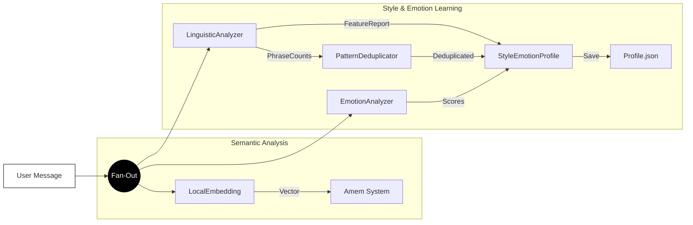
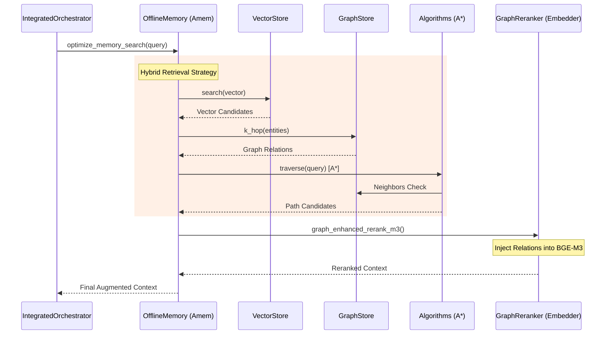
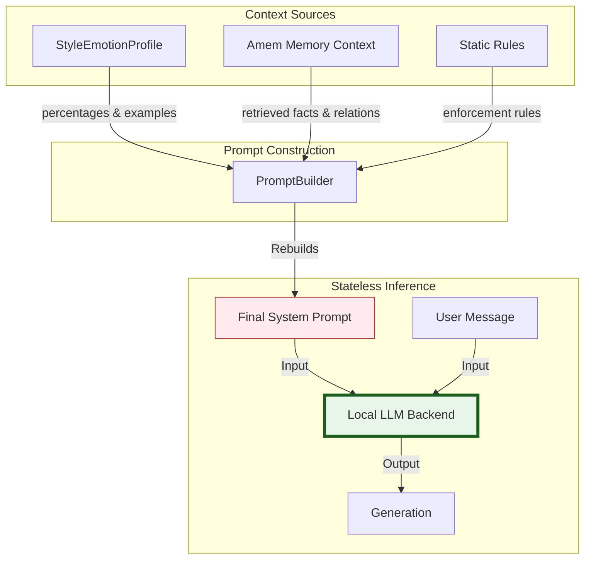

# Architecture Diagram

## Part 1 — System Decomposition Diagrams

### 1. Small Systems (Atomic Components)

Atomic, single-responsibility components that perform specific tasks.

```mermaid
graph TB
    subgraph Analysis["Analysis Components"]
        LA[LinguisticAnalyzer<br/>(Feature Extraction)]
        EA[EmotionAnalyzer<br/>(RoBERTa Pipeline)]
        LE[LocalEmbedding<br/>(BGE-M3 Wrapper)]
    end

    subgraph MemoryAtomic["Memory Atoms"]
        LVS[LocalVectorStore<br/>(FAISS Wrapper)]
        GS[GraphStore<br/>(SQLite Property Graph)]
        EI[EntityIndex<br/>(SQLite Map)]
        NVI[NodeVectorIndex<br/>(FAISS Nodes)]
        SM[SQLiteManager<br/>(History)]
    end

    subgraph Logic["Deep Logic Units"]
        PD[PatternDeduplicator<br/>(Clustering Engine)]
        DSL[DSL Parser<br/>(Query Parsing)]
        ALG[Algorithms<br/>(A* / Dijkstra)]
    end
    
    subgraph Backend["Inference"]
        LLM[LocalLLM<br/>(GGUF/HF Backend)]
    end

    style LA fill:#e1f5fe,stroke:#01579b
    style EA fill:#e1f5fe,stroke:#01579b
    style LE fill:#e1f5fe,stroke:#01579b
    style LVS fill:#fff3e0,stroke:#e65100
    style GS fill:#fff3e0,stroke:#e65100
    style EI fill:#fff3e0,stroke:#e65100
    style NVI fill:#fff3e0,stroke:#e65100
    style SM fill:#fff3e0,stroke:#e65100
    style PD fill:#f3e5f5,stroke:#4a148c
    style DSL fill:#f3e5f5,stroke:#4a148c
    style ALG fill:#f3e5f5,stroke:#4a148c
    style LLM fill:#e8f5e9,stroke:#1b5e20
```

### 2. Mid Systems (Composite Pipelines)

Composite systems that coordinate multiple atomic components.

```mermaid
graph TB
    subgraph StyleSystem["Style & Emotion Composite"]
        SEP[StyleEmotionProfile<br/>(Aggregator + Persistence)]
        PM[PatternMemory<br/>(Deduplication Storage)]
        PB[PromptBuilder<br/>(Rule Assembly)]
        SEP --> PM
    end

    subgraph RetrievalSystem["Retrieval Pipeline"]
        HR[HybridRetriever<br/>(Vector + Graph + Recency)]
        GR[GraphReranker<br/>(Graph-Enhanced BGE-M3)]
        PL[Planner<br/>(DSL Execution)]
        
        HR --> GR
    end

    subgraph Interfaces["Interface Components"]
        API[App Interface<br/>(Streamlit/FastAPI)]
        CLI[Command Line<br/>(Argparse)]
    end

    style SEP fill:#e1f5fe,stroke:#01579b
    style PM fill:#e1f5fe,stroke:#01579b
    style PB fill:#e1f5fe,stroke:#01579b
    style HR fill:#fff3e0,stroke:#e65100
    style GR fill:#fff3e0,stroke:#e65100
    style PL fill:#fff3e0,stroke:#e65100
```

### 3. Large Systems (Orchestrators)

End-to-end platforms that manage the lifecycle of interaction.

```mermaid
graph TB
    subgraph Orchestration["Major Systems"]
        OS[IntegratedOrchestrator<br/>(integrated_system.py)]
        SS[LLM_Style System<br/>(style_system.py)]
        AS[Amem Memory System<br/>(OfflineMemory / memory.py)]
        PI[Prompt Inspector<br/>(prompt_inspector.py)]
    end

    OS --> SS
    OS --> AS
    
    style OS fill:#e8eaf6,stroke:#1a237e,stroke-width:2px
    style SS fill:#e1f5fe,stroke:#01579b,stroke-width:2px
    style AS fill:#fff3e0,stroke:#e65100,stroke-width:2px
    style PI fill:#f3e5f5,stroke:#4a148c,stroke-width:2px
```

---

## Part 2 — Inter-System Connectivity Diagrams

### 1. Analysis & Learning Flow (Parallel)

Shows how user input is processed for style and emotion without LLM involvement.



### 2. Memory Retrieval Flow using Algorithms

Shows the interaction between the orchestrator and the deep logic inside Amem.



### 3. Prompt Reconstruction & Inference

Visualizes how the LLM receives a fully assembled state.



---

## Part 3 — Full-Fledged All-in-One Architecture Diagram

```mermaid
flowchart TB
    %% --- External Layer ---
    subgraph UserLayer["User Interaction"]
        User(["User"])
    end

    %% --- Orchestration Layer ---
    subgraph Orchestration["Integrated Orchestration (integrated_system.py)"]
        IO[Orchestrator Core]
        PB[Prompt Builder]
    end

    %% --- Style System ---
    subgraph LLMStyle["LLM_Style System"]
        direction TB
        LA[LinguisticAnalyzer]
        EA[EmotionAnalyzer]
        SEP[StyleEmotionProfile]
        PD[PatternDeduplicator]
        PM[PatternMemory]
        
        saved_profile[("Profile.json")]
    end

    %% --- Memory System ---
    subgraph Amem["Amem Memory System"]
        direction TB
        OM[OfflineMemory]
        LE[LocalEmbedding / BGE-M3]
        
        subgraph Stores["Storage Engines"]
            VS[("VectorStore\n(FAISS)")]
            GS[("GraphStore\n(SQLite)")]
            EI[("EntityIndex\n(SQLite)")]
            NV[("NodeVectorIndex\n(FAISS)")]
        end
        
        subgraph Logic["Deep Logic"]
            Alg[Algorithms (A*)]
            GraphRerank[GraphReranker]
        end
    end

    %% --- Inference Layer ---
    subgraph Inference["Inference Layer"]
        LLM[("LocalLLM\n(Stateless)")]
    end

    %% --- Connections ---
    
    %% Input Fan-Out
    User --> IO
    IO --> |Text| LA
    IO --> |Text| EA
    IO --> |Query| OM
    
    %% Style Learning
    LA --> |Features| SEP
    LA --> |Phrases| PD
    PD <--> PM
    PD --> SEP
    EA --> |Scores| SEP
    SEP --> saved_profile
    
    %% Memory Retrieval
    OM --> |Embed| LE
    OM --> |Search| VS
    OM --> |Traverse| GS
    OM --> |Lookup| EI
    OM --> |Node Search| NV
    
    OM --> |Pathfind| Alg
    Alg <--> GS
    
    %% Reranking
    VS & GS & Alg --> |Candidates| GraphRerank
    GraphRerank --> |Ranked Context| OM
    
    %% Prompt Assembly (Critical Path)
    SEP --> |"Style/Emotion Params"| PB
    OM --> |"Retrieved Context"| PB
    
    %% Inference
    PB --> |"Dynamic System Prompt"| LLM
    User --> |"Message"| LLM
    LLM --> |"Response"| User

    %% Styling
    classDef storage fill:#fff3e0,stroke:#e65100
    classDef logic fill:#e1f5fe,stroke:#01579b
    classDef component fill:#f3e5f5,stroke:#4a148c
    classDef critical fill:#ffebee,stroke:#c62828,stroke-width:2px
    
    class VS,GS,EI,NV,saved_profile storage
    class LA,EA,SEP,PD,PM,OM,LE,Alg,GraphRerank logic
    class IO,PB component
    class LLM critical
```

---

## Part 4 — Architectural Evolution (Context-Aware Reranking)

### Difference: Standard vs. Context-Aware

Visualizing how the new **Context Injection Pipeline** transforms the retrieval process.

```mermaid
graph TB
    %% --- BEFORE: Existing Architecture ---
    subgraph Legacy["Phase 1: Standard Hybrid (Graph Only)"]
        direction TB
        Q1[Query] --> VS1[Vector Search]
        Q1 --> GT1[Graph Traversal]
        
        VS1 --> Mix1[Merge Candidates]
        GT1 --> Mix1
        
        Mix1 --> Score1[Internal Hybrid Scorer<br/>(Weighted Sum)]
        Score1 --> Fail1[Fails Complex Negation]
        
        style Score1 fill:#f5f5f5,stroke:#666,stroke-dasharray: 5 5
    end

    %% --- AFTER: New Context-Aware Architecture ---
    subgraph Modern["Phase 2: Context-Aware Unified Search"]
        direction TB
        Q2[Query] --> VS2[Vector Search]
        VS2 --> Raw[Raw Candidates]
        
        subgraph ContextLoop["Context Injection Pipeline (NEW)"]
            direction TB
            Raw --> Lookup[Graph Context Lookup]
            Lookup --> NL[Natural Language Transform<br/>('Aarav works as...')]
            NL --> Aug[Augmented Memory<br/>(Text + Rich Context)]
        end
        
        Aug --> BGE[BGE-M3 Reranker<br/>(Full Semantic Awareness)]
        BGE --> Success2[Handles Negation/Exclusion]
        
        style ContextLoop fill:#e3f2fd,stroke:#1565c0,stroke-width:2px
        style BGE fill:#f3e5f5,stroke:#7b1fa2,stroke-width:2px
    end
    
    %% Visual separation
    Legacy ~~~ Modern
```
