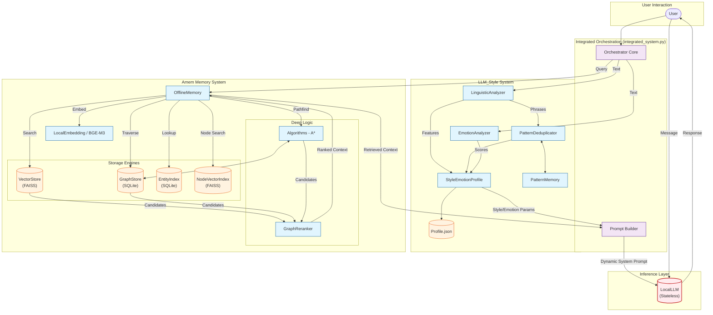
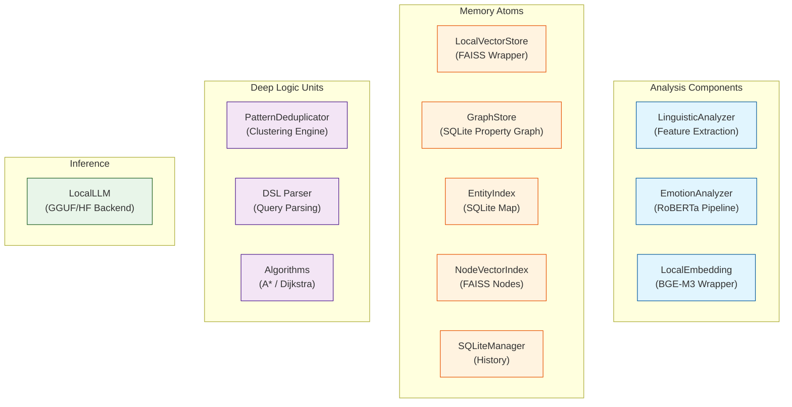
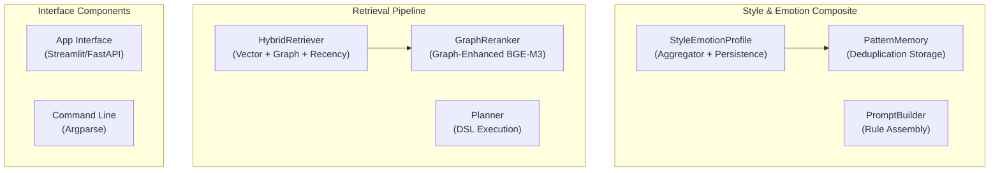
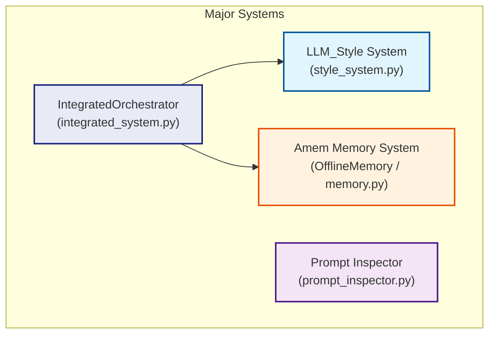
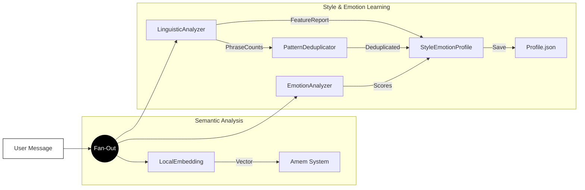
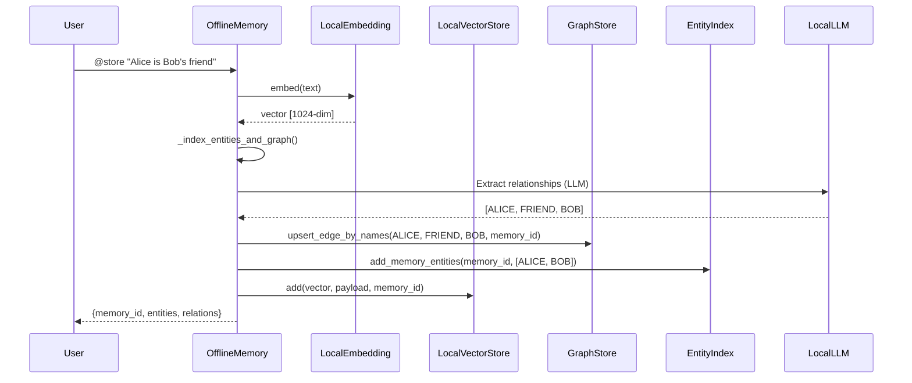
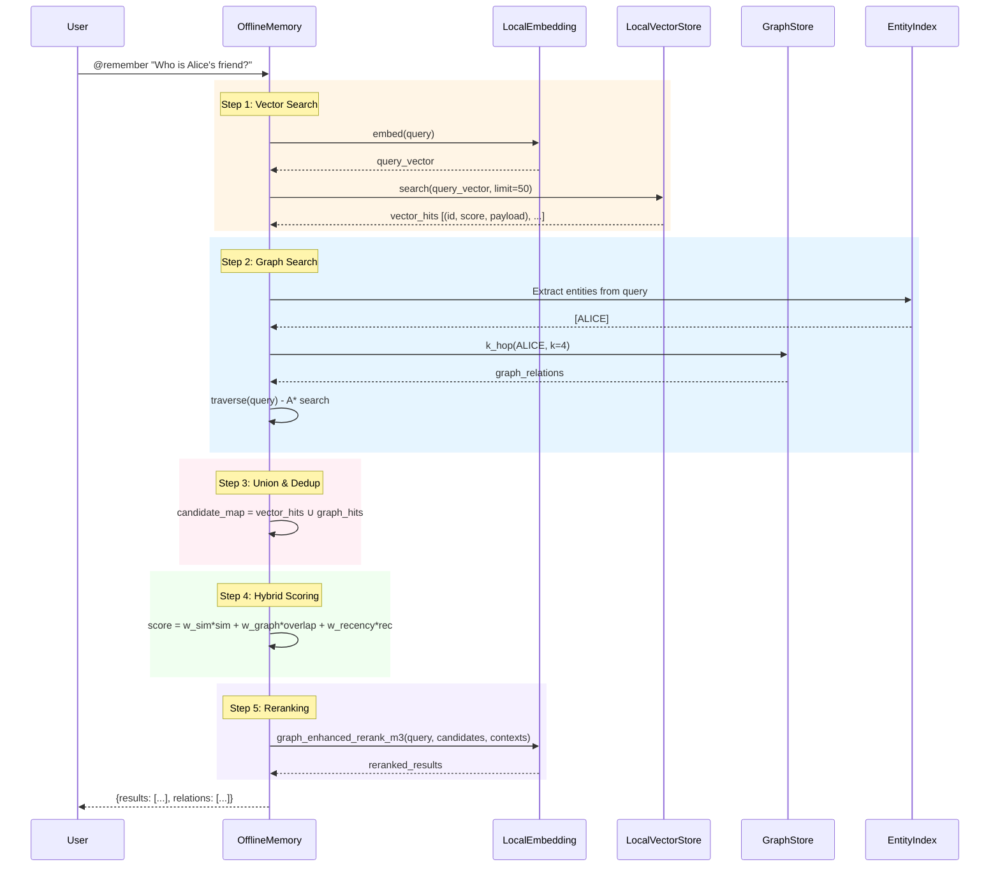
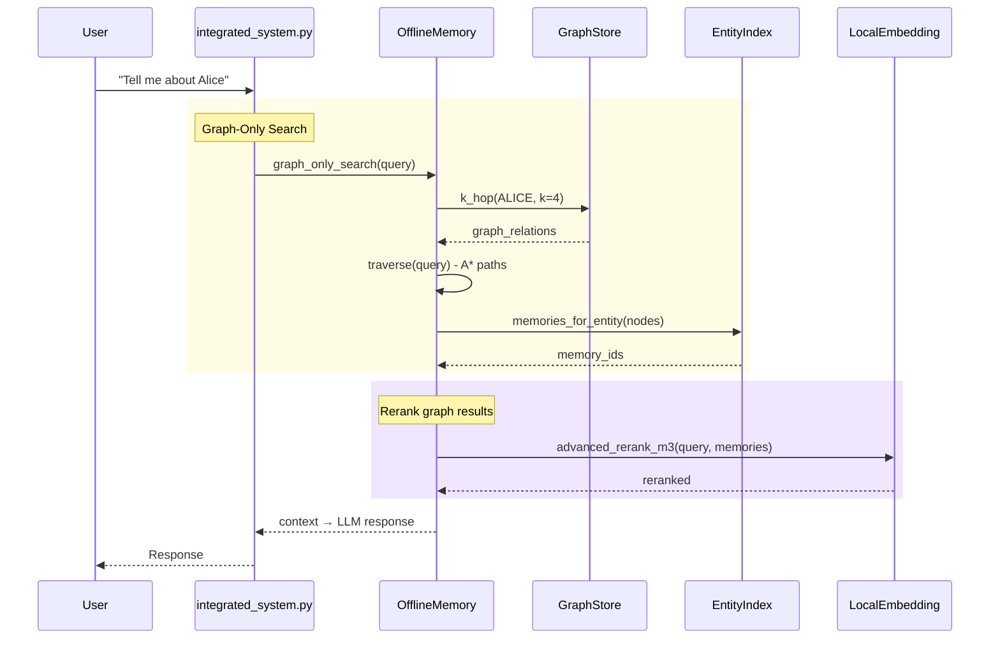
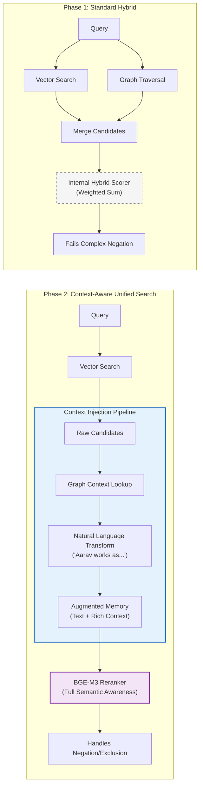
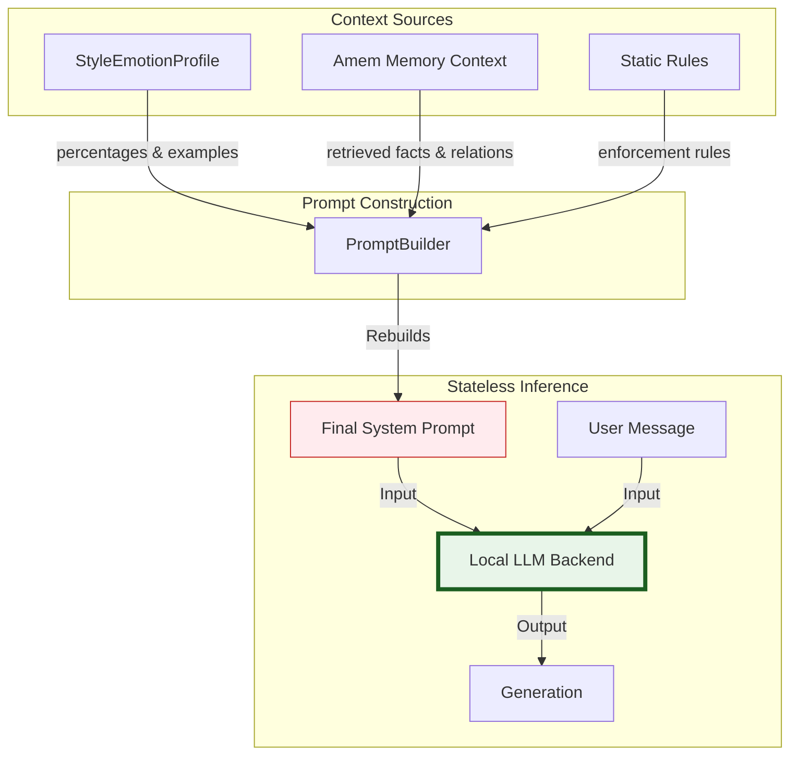

<p align="center">
  <h1 align="center">🧠 Araisha — Offline-First Conversational AI with Persistent Memory</h1>
  <p align="center">
    <em>A fully local, privacy-preserving conversational AI system that remembers everything,<br/>clones your texting style in real-time, and reasons over a knowledge graph — all without a single API call.</em>
  </p>
  <p align="center">
    
    
    
    
    
  </p>
</p>

---

## 📑 Table of Contents

- [Overview](#-overview)
- [Key Features](#-key-features)
- [System Architecture](#-system-architecture)
  - [High-Level Architecture](#high-level-architecture)
  - [System Decomposition](#system-decomposition)
  - [Component Connectivity](#component-connectivity)
- [Core Subsystems](#-core-subsystems)
  - [Amem — Memory Engine](#1-amem--memory-engine)
  - [LLM_Style — Style & Emotion Cloning](#2-llm_style--style--emotion-cloning)
  - [ASR — Voice Input](#3-asr--voice-input)
  - [Integrated Orchestrator](#4-integrated-orchestrator)
- [Memory Pipeline — Deep Dive](#-memory-pipeline--deep-dive)
  - [Storage Pipeline (@store)](#storage-pipeline-store)
  - [Retrieval Pipeline (@remember)](#retrieval-pipeline-remember)
  - [Graph Traversal — A* Search](#graph-traversal--a-search)
  - [Context-Aware Reranking](#context-aware-reranking)
- [Dynamic System Prompt Architecture](#-dynamic-system-prompt-architecture)
- [Project Structure](#-project-structure)
- [Models & Dependencies](#-models--dependencies)
- [Configuration Reference](#-configuration-reference)
- [Getting Started](#-getting-started)
- [CLI Commands Reference](#-cli-commands-reference)
- [Benchmark Results](#-benchmark-results)
- [Data Persistence & Operations](#-data-persistence--operations)
- [Security & Privacy](#-security--privacy)
- [Acknowledgments](#-acknowledgments)
- [A Note on Code Style — Vibe Coded 🎨](#-a-note-on-code-style--vibe-coded-)
- [Contributing](#-contributing)

---

## 🌟 Overview

**Araisha** is an end-to-end conversational AI platform designed to run **entirely offline** on consumer hardware. It combines three tightly integrated subsystems:

| Subsystem | Purpose | Key Tech |
|-----------|---------|----------|
| **Amem** (Memory Engine) | Persistent hybrid graph+vector memory with LLM-driven relationship extraction | SQLite Property Graph, FAISS HNSW, BGE-M3 |
| **LLM_Style** (Style Cloning) | Real-time linguistic & emotional profiling that dynamically adapts the LLM's personality | LinguisticAnalyzer, RoBERTa GoEmotions, Pattern Deduplication |
| **ASR** (Voice Input) | Streaming speech-to-text with turn-repair stitching | NVIDIA NeMo Nemotron 0.6B |

The system ensures that **no data ever leaves the device** — all models, embeddings, storage, and inference happen locally.

---

## ✨ Key Features

- **🔒 100% Offline** — All models (LLM, embeddings, emotion, ASR) run locally. Zero cloud dependency.
- **🧠 Hybrid Memory** — Combines FAISS vector similarity with SQLite property graph traversal for multi-hop reasoning.
- **🎭 Style Cloning** — Learns your texting style (elongations, emojis, punctuation, slang) and emotional tone in real-time.
- **🔍 Graph Reasoning** — A* traversal for possessive chains (e.g., _"Who is Alice's friend's father?"_), temporal queries, and relationship inference.
- **📊 Context-Aware Reranking** — Graph-enhanced BGE-M3 cross-encoder that injects relationship context into semantic scoring.
- **🎤 Voice Input** — NeMo-based streaming ASR with turn-repair and silence-based endpoint detection.
- **🔄 Real-Time Learning** — Every user message updates the style profile, emotion palette, and memory graph simultaneously.
- **💾 Persistent State** — All memory, profiles, and graph data persist across sessions via SQLite and FAISS indices.

---

## 🏗 System Architecture

### High-Level Architecture

The system follows a **three-layer architecture**: User Interaction → Orchestration → Subsystem Engines.



### System Decomposition

The system decomposes into **three tiers** of increasing complexity:

#### Tier 1 — Atomic Components (Single Responsibility)



#### Tier 2 — Composite Pipelines



#### Tier 3 — Orchestrators



### Component Connectivity

#### Analysis & Learning Flow (Parallel Fan-Out)

When a user message arrives, it is processed in **parallel** by three independent pipelines:



---

## 🔧 Core Subsystems

### 1. Amem — Memory Engine

The **Amem** (Associative Memory) subsystem provides persistent, graph-augmented memory with hybrid retrieval. It is the backbone of Araisha's long-term knowledge.

#### Storage Components

| Component | Implementation | Purpose |
|-----------|---------------|---------|
| `LocalVectorStore` | FAISS HNSW (1024-dim, cosine) | Semantic similarity search over memory texts |
| `GraphStore` | SQLite Property Graph | Directed relationship graph with nodes, edges, properties, and cluster tracking |
| `EntityIndex` | SQLite FTS | Maps `memory_id → [entities]` for fast entity-based lookups |
| `NodeVectorIndex` | FAISS (separate collection) | Vector embeddings for entity names and path fragments |
| `SQLiteManager` | SQLite | Event history (ADD/UPDATE/DELETE) for audit and lineage |
| `LocalEmbedding` | BGE-M3 (1024-dim) | Embeds texts, entity names, and path fragments; also provides cross-encoder reranking |

#### Graph Store Design

The `GraphStore` implements a **full property graph** in SQLite with:

- **Nodes**: `(node_id, name, label, props_json, created_at, updated_at, cluster_id)`
- **Edges**: `(source, relationship, destination, weight, memory_id, created_at, updated_at, source_node_id, destination_node_id)`
- **Edge Properties**: Key-value pairs attached to edges (e.g., `time_window`, `date`)
- **Unique Constraint**: `(source, relationship, destination)` ensures no duplicate edges
- **Weight Accumulation**: Repeated upserts increment edge weight, reflecting evidence confidence

#### Key Methods in `OfflineMemory`

| Method | Description |
|--------|-------------|
| `add(text, metadata)` | Embeds text, extracts entities & relationships via LLM, stores in all indices |
| `search(query, top_k)` | Hybrid retrieval: vector search + graph expansion + A* traversal + reranking |
| `update(memory_id, text)` | Re-embeds, re-extracts relationships, replaces graph edges for memory |
| `delete(memory_id)` | Soft-deletes from FAISS, removes graph edges and path vectors |
| `graph_only_search(query)` | Pure graph traversal without vector search — for entity-centric queries |
| `traverse(query)` | A*-based graph pathfinding for possessive chains and multi-hop inference |

---

### 2. LLM_Style — Style & Emotion Cloning

The **LLM_Style** subsystem learns a user's texting patterns and emotional tendencies in real-time, then dynamically constructs a system prompt that forces the LLM to mirror those patterns.

#### Pipeline Components

| Component | File | Purpose |
|-----------|------|---------|
| `LinguisticAnalyzer` | `linguistic_analyzer.py` | Extracts 50+ features: elongations, emoji placement, casing habits, punctuation patterns, slang, fillers, hedges, keysmash, n-grams |
| `EmotionAnalyzer` | `profile_index.py` | RoBERTa-based GoEmotions classifier producing 28 emotion scores per message |
| `StyleEmotionProfile` | `profile_index.py` | Aggregates features over time with exponential moving averages; computes style blueprint percentages |
| `PatternDeduplicator` | `pattern_deduplicator.py` | Clustering engine that deduplicates phrase counts to avoid redundancy in the style blueprint |
| `PromptInspector` | `prompt_inspector.py` | Debug utility that visualizes and validates the assembled system prompt |

#### Linguistic Features Extracted

The `LinguisticAnalyzer` produces a `FeatureReport` dataclass with the following categories:

```
├── meta                   # chars, tokens, sentences
├── structure              # avg_sentence_len, question/exclamation/period ratios
├── punctuation            # commas, semicolons, repeated punct (!!!, ???), ellipsis, oxford comma
├── casing                 # ALL_CAPS ratio, title case, lowercase starts, lowercase "i"
├── emoji                  # count, per-token ratio, placement (start/mid/end of sentence)
├── elongation             # "sooooo", "bestieee" — ratio and examples
├── repetition             # adjacent repeated words
├── lexical                # fillers, hedges, slang, affective words, user-frequent, user-signature, user-rare
├── special                # URLs, handles, keysmash detection
└── negatives              # things user NEVER does (no capitals, no oxford comma, etc.)
```

#### Style Blueprint Output

The profile generates a **Style Blueprint** that is injected into the system prompt:

```
Emotional Palette → admiration: 15.1%, love: 14.5%, curiosity: 10.9%, excitement: 6.2%, ...
Style Blueprint:
  - all_caps: {5.4%}
  - elongations: [YOOOOO, bestieee, meeee, wayyy] {7.3%}
  - emojis: [🤩, 🚀, 🎊, 🤖, 🧠] {8.7%}
  - repeated_punct: {8.0%}
  - exclamations: {14.5%}
  - user_signature: [periodt, bestieee, honeyyyy, scrumptious] {14.5%}
  - avg_sentence_length: [4.8]
```

---

### 3. ASR — Voice Input

The **ASR** module provides streaming voice input using NVIDIA's **NeMo Nemotron Speech Streaming 0.6B** model.

#### Key Design Decisions

| Feature | Value | Rationale |
|---------|-------|-----------|
| Sample Rate | 16kHz | Standard for speech models |
| Chunk Size | 100ms | Low-latency chunk processing |
| Silence Threshold | 0.015 RMS | Tuned for typical microphone noise floor |
| Silence Duration | 2.2s | Pause length that signals end-of-turn |
| Min Utterance Duration | 2.5s | Prevents false triggers on brief sounds |
| Merge Window | 2.5s | Time window for stitching adjacent utterances |
| Pre-Roll Buffer | 0.8s | Captures audio slightly before voice onset |

#### Turn-Repair Stitching

The ASR implements a **turn-repair** mechanism that handles the common case where a user pauses mid-sentence:

1. When silence is detected, the current audio is transcribed and held as a **pending segment**
2. If the user resumes speaking within the `MERGE_WINDOW_SEC` (2.5s), the new speech is **stitched** to the pending segment
3. The stitching uses **prefix deduplication**: if the new transcription starts with the old text, only the delta is appended
4. The final utterance is committed only after a full silence timeout with no continuation

---

### 4. Integrated Orchestrator

`integrated_system.py` is the **central coordinator** that ties all subsystems together. It:

1. **Initializes** the memory engine (`OfflineMemory`), style system (`LinguisticAnalyzer`, `EmotionAnalyzer`, `StyleEmotionProfile`), and optionally ASR
2. **Processes each user message** through a fan-out pipeline:
   - Linguistic analysis → style profile update
   - Emotion scoring → emotion palette update
   - Memory storage and retrieval
3. **Constructs the dynamic system prompt** by combining:
   - Static enforcement rules (emotion/style binding)
   - Dynamic style blueprint (from `StyleEmotionProfile`)
   - Retrieved memory context (from `OfflineMemory`)
   - Chat history (last 30 turns)
4. **Streams the LLM response** token-by-token
5. **Strips thinking tags** (`<think>...</think>`) from reasoning models before storing in history

#### LLM Backend Support

| Backend | Implementation | Use Case |
|---------|---------------|----------|
| `LocalLLM` (GGUF) | `llama-cpp-python` | CPU/GPU inference with quantized GGUF models |
| `LocalLLM` (HuggingFace) | `transformers` + `AutoModelForCausalLM` | Full-precision or quantized HF models |
| `ServerLLM` | OpenAI-compatible API client | External API (NVIDIA NIM, Azure OpenAI, LM Studio, Ollama) |

The backend is selected via CLI flags (`--llm-backend auto|intel|gguf`) or environment variables. The `ServerLLM` supports streaming, reasoning content extraction, and configurable `extra_body` parameters for models like Nemotron.

---

## 🔄 Memory Pipeline — Deep Dive

### Storage Pipeline (@store)

When a user says something worth remembering, the following sequence executes:



**Detailed Steps:**

1. **Text Embedding** — BGE-M3 generates a 1024-dim vector
2. **Name Detection** — Regex patterns detect "My name is X", "Call me X", etc. and persist to `user_profile.json`
3. **Entity Extraction** — Capitalized tokens and quoted phrases are extracted and indexed
4. **Pronoun Resolution** — `I/My/Me` → `USER`, `You/Your` → `ASSISTANT` (with persisted names)
5. **Graph Context Building** — Before calling the LLM, existing relationships for mentioned entities are gathered (k-hop neighbors)
6. **LLM Relationship Extraction** — A structured prompt instructs the LLM to output `SOURCE -- RELATION -- DESTINATION` triplets
7. **Triplet Canonicalization** — Relations are normalized (`WIFE` → `WIFE_OF`, `LIKE` → `LIKES`), deduplicated, and validated
8. **Graph Upsert** — Edges are inserted/updated with weight accumulation; temporal properties are extracted from text
9. **Node & Path Vectors** — Entity names and path fragments (`SRC REL DST`) are embedded and stored in the node vector index
10. **Entity Merging** — Optional similarity-based merging deduplicates near-identical entities
11. **Cluster Recomputation** — Connected components in the graph are recomputed

---

### Retrieval Pipeline (@remember)

Retrieval uses a **5-stage hybrid pipeline**:



#### Scoring Formula

```
final_score = w_similarity × vector_cosine_sim
            + w_graph     × entity_overlap_ratio
            + w_recency   × recency_bonus
            + w_evidence  × local_degree_score
            + w_lexical   × lexical_match_score
```

Default weights from `configs/offline.yaml`:

| Weight | Value | Purpose |
|--------|-------|---------|
| `w_similarity` | 0.60 | FAISS cosine similarity |
| `w_graph` | 0.20 | Entity overlap with graph neighbors |
| `w_recency` | 0.15 | Flat bonus for recent memories |
| `w_evidence` | 0.05 | Node degree in the graph (evidence count) |
| `w_lexical` | 0.20 | Lexical/keyword match scoring |

---

### Graph Traversal — A* Search

For queries involving possessive chains (e.g., _"Who is Alice's friend's father?"_) or `who is` patterns, the system uses **A* graph search**:



**A* Heuristics:**

- **Edge label compatibility** — How well the edge relationship matches the query intent
- **Recency bonus** — Prefer recently created/updated edges
- **Accumulated weight** — Edges with higher evidence counts are preferred
- **Degree penalty** — Hub nodes (high degree) are slightly penalized to avoid generic paths
- **Neighbor caching** — Graph neighbors are cached during traversal and cleared on mutations

---

### Context-Aware Reranking

The system evolves beyond standard hybrid retrieval with a **Context Injection Pipeline**:



The key innovation: **instead of scoring candidates independently, the reranker receives each candidate augmented with its graph context** (neighboring relationships as natural language). This allows the BGE-M3 cross-encoder to understand relational context when scoring, enabling it to handle complex negation, exclusion, and multi-hop queries that pure vector search cannot.

---

## 🎯 Dynamic System Prompt Architecture

The system prompt is **rebuilt on every turn** from three dynamic sources:

```
┌─────────────────────────────────────────────────────────┐
│                   SYSTEM PROMPT                          │
├─────────────────────────────────────────────────────────┤
│  [0] STATIC RULES                                       │
│  ├── Emotional Enforcement Rules                        │
│  ├── Style Enforcement Rules                            │
│  ├── Binding (emotion-first, then style)                │
│  ├── Adaptation (no resistance/delay)                   │
│  └── Hiddenness (never reveal rules)                    │
├─────────────────────────────────────────────────────────┤
│  [1] DYNAMIC STYLE PATTERN (from StyleEmotionProfile)   │
│  ├── Emotional Palette → admiration: 15.1%, love: 14.5% │
│  └── Style Blueprint                                    │
│      ├── all_caps: {5.4%}                               │
│      ├── elongations: [YOOOOO, bestieee] {7.3%}         │
│      ├── emojis: [🤩, 🚀, 🎊] {8.7%}                   │
│      ├── user_signature: [periodt, honeyyyy] {14.5%}    │
│      └── avg_sentence_length: [4.8]                     │
├─────────────────────────────────────────────────────────┤
│  [2] MEMORY CONTEXT (from Amem retrieval)               │
│  ├── ALICE --FRIEND_OF--> BOB                           │
│  ├── ARIA --WIFE_OF--> ABHISHEK                         │
│  └── "Aria is Abhishek's wife and Alya's sister"        │
├─────────────────────────────────────────────────────────┤
│  [3] CHAT HISTORY (last 30 turns)                       │
│  ├── User: Hi                                           │
│  └── Assistant: Hey there.                              │
└─────────────────────────────────────────────────────────┘
```



---

## 📁 Project Structure

```
Memory_Folder/
├── integrated_system.py          # 🎯 Main orchestrator — ties everything together
├── server_llm.py                 # 🌐 API-backed LLM client (NVIDIA NIM, Azure, Ollama)
├── requirements.txt              # 📦 Python dependencies
├── .env                          # 🔑 API keys and environment variables
│
├── Amem/                         # 🧠 Memory Engine
│   ├── __init__.py               #     Package exports
│   ├── memory.py                 #     OfflineMemory — core memory lifecycle (1868 lines)
│   ├── memory_system.py          #     CLI-facing memory system wrapper
│   ├── local_embedding.py        #     BGE-M3 embedding + cross-encoder reranking
│   ├── local_llm.py              #     Local LLM backend (GGUF + HuggingFace)
│   ├── local_config.py           #     Configuration dataclasses
│   ├── graph_store.py            #     SQLite property graph implementation
│   ├── vector_store.py           #     FAISS vector store wrapper
│   ├── entity_index.py           #     Entity-to-memory SQLite index
│   ├── node_vectors.py           #     FAISS index for entity/path vectors
│   ├── storage.py                #     SQLite history manager
│   ├── algorithms.py             #     A* / Dijkstra graph algorithms
│   ├── dsl.py                    #     Mini-Cypher DSL parser
│   ├── planner.py                #     DSL query planner/executor
│   ├── visualize.py              #     PyVis graph visualization
│   ├── utils.py                  #     md5_hash, utc_now_iso, merge_texts
│   └── vector_stores/            #     Additional vector store implementations
│
├── LLM_Style/                    # 🎭 Style & Emotion Cloning
│   ├── style_system.py           #     Interactive style learning chat + prompt builder
│   ├── linguistic_analyzer.py    #     50+ feature extractor (829 lines)
│   ├── profile_index.py          #     StyleEmotionProfile + EmotionAnalyzer
│   ├── pattern_deduplicator.py   #     Clustering-based phrase deduplication
│   └── prompt_inspector.py       #     System prompt visualization/debug tool
│
├── ASR/                          # 🎤 Voice Input
│   ├── asr.py                    #     Standalone NeMo ASR with real-time streaming
│   └── asr_wrapper.py            #     Importable wrapper with turn-repair stitching
│
├── configs/                      # ⚙️ Configuration
│   ├── offline.yaml              #     Main config: model paths, retrieval weights, reranker settings
│   └── logging.yaml              #     Logging configuration
│
├── interface/                    # 🖥️ Web Interface
│   ├── static/                   #     Static assets (CSS, JS)
│   └── templates/                #     HTML templates
│
├── models/                       # 🤖 Local Model Storage
│   ├── bge-m3/                   #     BGE-M3 embedding model
│   ├── roberta-base-go_emotions/ #     RoBERTa emotion classifier
│   ├── nemotron-speech-streaming-en-0.6b/  # NeMo ASR model
│   └── *.gguf                    #     Quantized LLM models
│
├── local_data/                   # 💾 Persistent Data
│   ├── graph.db                  #     SQLite property graph
│   ├── entity_index.db           #     Entity-memory mapping
│   ├── faiss/                    #     FAISS vector indices
│   ├── node_vectors/             #     Entity/path FAISS vectors
│   ├── style_emotion/            #     Learned style profiles
│   └── viz/                      #     PyVis graph visualizations
│
├── scripts/                      # 🔧 Operations
│   ├── rebuild_index.py          #     FAISS index compaction
│   └── export_graph.py           #     Graph CSV export
│
├── tests/                        # 🧪 Test Suite
│   ├── test_memory.py            #     Memory system tests
│   ├── test_api.py               #     API endpoint tests
│   └── test_gguf_detection.py    #     Backend detection tests
│
├── document/                     # 📄 Documentation & Diagrams
│   ├── *.png                     #     Architecture sequence diagrams
│   └── *.pdf                     #     Reference documents
│
├── Architecture.md               # 📐 Detailed architecture specification
├── Architecture_Diagram.md       # 📊 Mermaid diagram collection
├── memory_pipeline.txt           # 🔄 Pipeline flow documentation
└── system_prompt_structure.txt   # 📝 System prompt template reference
```

---

## 🤖 Models & Dependencies

### Required Models

| Model | Size | Purpose | Path |
|-------|------|---------|------|
| **BGE-M3** | ~2.3 GB | Text embeddings (1024-dim) + Cross-encoder reranking | `./models/bge-m3/` |
| **RoBERTa GoEmotions** | ~500 MB | 28-class emotion classification | `./models/roberta-base-go_emotions/` |
| **LLM (GGUF)** | 2-8 GB | Conversational generation + relationship extraction | `./models/*.gguf` |
| **NeMo Nemotron 0.6B** | ~1.2 GB | Streaming speech-to-text | `./models/nemotron-speech-streaming-en-0.6b/` |

### Python Dependencies

```
torch>=2.8.0                    # PyTorch (CPU or CUDA)
sentence-transformers>=5.1.0    # BGE-M3 wrapper
faiss-cpu>=1.11.0               # Vector search
llama-cpp-python>=0.3.16        # GGUF model inference
transformers>=4.45.0            # HuggingFace model loading
FlagEmbedding                   # BGE-M3 embeddings
numpy>=2.2.6                    # Numerical operations
pyvis>=0.3.2                    # Graph visualization
pydantic>=2.0.0                 # Data validation
loguru>=0.7.3                   # Logging
Jinja2>=3.1.4                   # Template rendering
psutil>=5.9.0                   # System monitoring
accelerate>=0.35.0              # HF model optimization
```

**Optional (for voice input):**
```
sounddevice                     # Microphone access
nemo_toolkit                    # NeMo ASR models
```

**Optional (for web interface):**
```
fastapi>=0.104.0                # Web API framework
uvicorn[standard]>=0.24.0       # ASGI server
python-socketio>=5.10.0         # WebSocket support
```

---

## ⚙️ Configuration Reference

The main configuration is in `configs/offline.yaml`:

```yaml
# LLM Configuration
llm:
  model_path: ./models              # Path to LLM model files
  backend: auto                     # auto | intel | gguf
  device: auto                      # auto | cpu | cuda
  max_new_tokens: 256
  temperature: 0.3
  top_p: 0.9

# Embedding Model
embedder:
  model_path: ./models/bge-m3
  embedding_dims: 1024
  max_length: 1024

# Emotion Analyzer
emotion_analyzer:
  model_path: ./models/roberta-base-go_emotions
  confidence_threshold: 0.1

# Vector Store (FAISS)
vector_store:
  path: ./local_data/faiss
  distance_strategy: cosine
  index_type: HNSW
  normalize: true

# Graph Store (SQLite)
graph:
  db_path: ./local_data/graph.db

# Retrieval Weights
retrieval:
  initial_top_k: 50                # Candidates from FAISS
  final_top_k: 10                  # Final returned results
  merge_similarity_threshold: 0.82 # Threshold for memory merging
  scoring:
    w_similarity: 0.6              # Vector cosine similarity
    w_graph: 0.2                   # Graph entity overlap
    w_recency: 0.15                # Recency bonus
    w_evidence: 0.05               # Edge weight / degree
    w_lexical: 0.2                 # Lexical match

# Reranker (BGE-M3 Cross-Encoder)
reranker:
  enabled: true
  top_k: 10
  graph_enhanced: true              # Inject graph context into reranking
  advanced_fusion: true             # Use context-aware fusion
  graph_context_depth: 3            # k-hop depth for context gathering
  entity_boost_factor: 0.15
```

---

## 🚀 Getting Started

### Prerequisites

- Python 3.10+
- 8+ GB RAM (16 GB recommended for larger LLMs)
- NVIDIA GPU (optional, for faster inference)

### Installation

```bash
# 1. Clone the repository
git clone <repository-url>
cd Memory_Folder

# 2. Install dependencies
pip install -r requirements.txt

# 3. Download models (place in ./models/)
# - BGE-M3:           huggingface-cli download BAAI/bge-m3 --local-dir ./models/bge-m3
# - RoBERTa Emotions: huggingface-cli download SamLowe/roberta-base-go_emotions --local-dir ./models/roberta-base-go_emotions
# - LLM (GGUF):       Download your preferred GGUF model to ./models/

# 4. (Optional) Set up API keys for ServerLLM mode
cp .env.example .env
# Edit .env with your API keys
```

### Running

```bash
# Interactive CLI mode (fully offline)
python integrated_system.py --llm-backend gguf

# With voice input
python integrated_system.py --llm-backend gguf --voice

# With server-backed LLM (NVIDIA NIM, Azure, etc.)
python integrated_system.py --local-api-url http://localhost:1234/v1

# Debug mode (shows retrieval scores, graph context, etc.)
python integrated_system.py --llm-backend gguf --debug

# Style-only learning demo
cd LLM_Style
python style_system.py --mode demo
```

---

## 📋 CLI Commands Reference

| Command | Syntax | Description |
|---------|--------|-------------|
| `@store` | `@store <text>` | Store a memory with relationship extraction |
| `@remember` | `@remember <query>` | Retrieve relevant memories with hybrid search |
| `@update` | `@update <memory_id> <new_text>` | Update an existing memory |
| `@updateq` | `@updateq <query> <new_text>` | Update a memory found by query |
| `@delete` | `@delete <memory_id>` | Delete a memory by ID |
| `@query` | `@query MATCH (a)-[:REL]->(b)` | Execute a mini-Cypher graph query |
| `@path` | `@path <entity1> <entity2>` | Find shortest path between entities |
| `@viz` | `@viz [entity]` | Generate PyVis graph visualization |
| `@merge` | `@merge` | Run entity/relationship similarity merging |
| `@rebuild` | `@rebuild` | Rebuild and compact FAISS indices |

In normal conversation mode (without `@` prefix), the system:
1. Learns your style from the message
2. Retrieves relevant memories automatically
3. Responds with your cloned style and emotional profile

---

## 📊 Benchmark Results

The system includes comprehensive benchmarks for memory retrieval accuracy. Test data covers:

- **Direct recall** — "What is X?" queries
- **Multi-hop reasoning** — "Who is Alice's friend's father?"
- **Temporal queries** — "What happened yesterday?"
- **Negation handling** — "Who is NOT friends with Alice?"
- **Possessive chains** — "Alice's friend's husband's job"

Benchmark results are stored in `benchmark_results.json`, `benchmark_1_results.txt`, and `benchmark_2_results.txt`.

---

## 💾 Data Persistence & Operations

### Data Files

| File | Type | Content |
|------|------|---------|
| `local_data/graph.db` | SQLite | Property graph (nodes, edges, properties) |
| `local_data/entity_index.db` | SQLite | Entity-to-memory mapping |
| `local_data/faiss/mem0.faiss` | FAISS | Memory text vectors |
| `local_data/faiss/mem0.pkl` | Pickle | FAISS metadata docstore |
| `local_data/node_vectors/` | FAISS | Entity name and path fragment vectors |
| `local_data/style_emotion/learned_profile.json` | JSON | Accumulated style/emotion profile |
| `local_data/style_emotion/enhanced_system_prompt.txt` | Text | Last generated system prompt |
| `local_data/user_profile.json` | JSON | User/assistant name, age, location |

### Operations

```bash
# Rebuild FAISS index (compaction after many deletes)
python scripts/rebuild_index.py

# Export graph to CSV
python scripts/export_graph.py
# → outputs nodes.csv, edges.csv

# Backup (copy these files)
cp -r local_data/ backup/local_data/
# Models are static and don't need frequent backup
```

---

## 🔒 Security & Privacy

- **Zero External Calls** — All processing (LLM inference, embedding, emotion analysis, ASR) runs locally
- **No Telemetry** — No data is sent to any server under any circumstance
- **Local Storage Only** — All data persists in `local_data/` under your control
- **Configurable Paths** — All file paths are configurable via `configs/offline.yaml`
- **Optional Server Mode** — `ServerLLM` is opt-in and only activated with explicit CLI flags
- **API Key Isolation** — When using `ServerLLM`, keys are resolved from environment variables only; never logged or stored

---

## 🙏 Acknowledgments

This project gratefully uses the following open-source models and technologies:

- **[NVIDIA NeMo](https://github.com/NVIDIA/NeMo)** — The **Nemotron Speech Streaming EN 0.6B** model powers the real-time ASR (Automatic Speech Recognition) subsystem. Huge thanks to the NVIDIA NeMo team for making state-of-the-art streaming speech-to-text models available for local, on-device inference.
- **[BAAI — Beijing Academy of Artificial Intelligence](https://huggingface.co/BAAI)** — The **BGE-M3** embedding model is the semantic backbone of the entire memory system. It handles text embedding (1024-dim), cross-encoder reranking, and context-aware fusion. Thank you to BAAI for building one of the most versatile multilingual embedding models available.
- **[Hugging Face](https://huggingface.co)** — For the `transformers`, `sentence-transformers`, and `FlagEmbedding` ecosystems that make local model inference practical.
- **[Meta AI](https://ai.meta.com)** — For the Llama model family that forms the foundation of many compatible GGUF models.
- **[Facebook Research / FAISS](https://github.com/facebookresearch/faiss)** — For the blazing-fast vector similarity search that powers our memory retrieval.

---

## 🎨 A Note on Code Style — Vibe Coded

> **This project is vibe coded.** 🎶

What does that mean? It means the code was built iteratively, feature by feature, following the energy and flow of ideas rather than a strict upfront architecture plan. As a result:

- **File connections and cross-module function calls are more numerous** than in a traditionally architected codebase. Components reach across module boundaries more freely.
- **Logic breakdowns are more granular** — you'll find many smaller helper functions, inline conditionals, and defensive patterns rather than large, monolithic methods.
- **The code works and works well**, but the structure has room for refactoring — deduplication, cleaner separation of concerns, more consistent error handling, and better interface abstractions.

This is a **living, evolving project**, and the vibe-coded nature is part of its DNA. If you're the kind of developer who loves untangling complex systems and making them elegant — this is your playground.

---

## 🤝 Contributing

Contributions are **warmly welcome** and genuinely appreciated! 🎉

This project would benefit greatly from community help in areas like:

- **🧹 Code Refactoring** — Cleaner module boundaries, reduced cross-file coupling, consistent patterns
- **📝 Documentation** — More inline docstrings, API documentation, and usage examples
- **🧪 Testing** — Expanding test coverage, adding integration tests, edge case handling
- **⚡ Performance** — Optimizing graph traversal, FAISS index management, and memory footprint
- **🎨 Interface** — Improving the web UI, adding new visualization features
- **🐛 Bug Fixes** — If you find something broken, please open an issue or submit a PR!

### How to Contribute

1. **Fork** the repository
2. **Create a feature branch** (`git checkout -b feature/your-improvement`)
3. **Make your changes** and add tests where applicable
4. **Submit a Pull Request** with a clear description of what you changed and why

Whether it's a one-line typo fix or a full architectural refactor — every contribution makes this project better. Thank you! 🙌

---

<p align="center">
  <em>Built with ❤️ for privacy-first, offline-first AI</em><br/>
  <em>Open for contributions — let's build something great together.</em>
</p>
